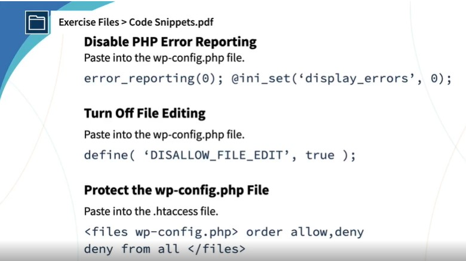

## 3. WordPress Security

### SSL Plugin

https://ru.wordpress.org/plugins/really-simple-ssl/

### Another courses

Building a secure WordPress website

### 12 Secure Plugins

WP 2FA

Limit Login Attempts Reloaded

Admin login URL Change

Inactive Logout

User Activity Log

Wordfence Security

Sucuri Security

UpdraftPlus

### 13 Secure code

То есть 
- отключить PHP Error Reporting (в самом начале файла wp-config.php) 
- отключить редактирование файлов (добавляется в wp-config.php) 
- защитить wp-config.php в htaccess

Дополнительный курс:

Wordpress: Building a Secure Site

## 4. Pages

Для прототипов:

https://wireframe.cc/

## 5. Posts

Плагин исправляет поломанные изображения, если сменили тему

https://wordpress.org/plugins/force-regenerate-thumbnails/

https://ru.wordpress.org/plugins/force-regenerate-thumbnails/

## 6. Plugins and Themes

https://wordpress.org/plugins/

https://www.hubspot.com/

##
