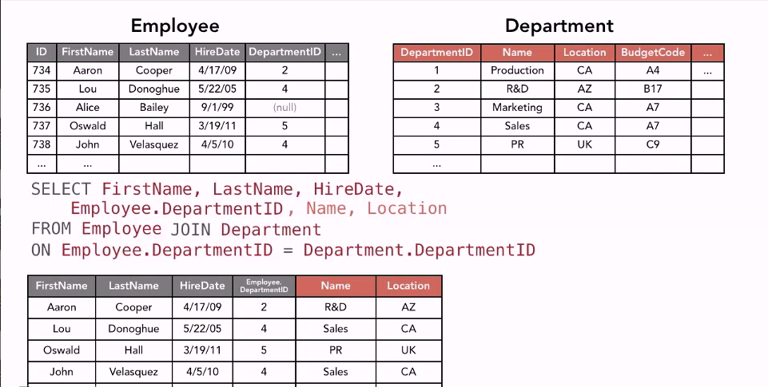

## 07-05 JOIN. Соединение таблиц

Пример простого запроса JOIN:

Он же является внутренним соединением - INNER JOIN:

Пример левого внешнего соединения. Левое - означает, таблица написанная слева от слова JOIN:

Пример правого внешнего соединения. Правое - означает, таблица написанная справа от слова JOIN:

## 07-06 Примеры запросов SQL

    INSERT INTO Employee
    (FirstName, LastName, Department, Salary) 
    VALUES ('Joe', 'Allen', 'Sales', 45000)

    UPDATE Employee
    SET Email = 'joea@twotreesoliveoil.com'
    WHERE EmployeeID = 734

Проверка Select перед удалением

    SELECT *
    FROM Employee
    WHERE EmployeeID = 734

    DELETE 
    FROM Employee
    WHERE EmployeeID = 734

## 07-07 Языки определения данных. DML, DDL, DCL.

Data manipulation  
DML - Select, Insert, Update, Delete

Data definition  
DDL - Create, Alter, Drop

Data control  
DCL - Grant, Revoke

Примеры:

    CREATE Employee   
    (EmployeeID  INTEGER PRIMARY KEY,
    FirstName    VARCHAR (35) NOT NULL,
    LastName     VARCHAR (100) NOT NULL,
    Department   VARCHAR (30) NULL,
    Salary       INTEGER
    );

    ALTER TABLE Employee
    ADD Email VARCHAR(100);

    DROP TABLE Employee;

## 08_02 Конфликты при записи

В базах данных предусмотрены оптимистические и пессимистические блокировки при конфликтах записи, например, при транзакциях.

---

