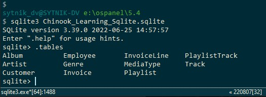

## 004-Starting SQLite

https://sqlite.org/

https://sqlite.org/download.html

1.

Precompiled Binaries for Windows

sqlite-dll-win-x64-3490100.zip  
64-bit DLL (x64) for SQLite version 3.49.1.

sqlite-tools-win-x64-3490100.zip  
A bundle of command-line tools for managing SQLite database files.

Эти файлы должны быть распакованы в одну папку, например, в c:/sqlite. И путь c:/sqlite должен быть добавлен в PATH. 

    Панель управления\Учетные записи пользователей\Учетные записи пользователей
    Раздел - Изменение переменных сред

После этого запуск возможен из командной строки.

2.

Но возможно также подключение в OSPanel. Файл Chinook_Learning_Sqlite.sqlite добавил в e:\ospanel\5.4.

    sqlite3 Chinook_Learning_Sqlite.sqlite



## 005-The SQLite command line interface

```sql

.tables

SELECT * FROM Customer Limit 10;

.headers on

SELECT * FROM Invoice Limit 10;

CREATE TABLE test_table (name STRING, id INT);

INSERT INTO test_table VALUES ('Eric Seablade', 100);

SELECT * FROM test_table;

SELECT * FROM genre WHERE name LIKE 'S%';

INSERT INTO genre VALUES (26, 'Spoken Word');

UPDATE Genre SET name = 'Sci-Fi' WHERE name = 'Science Fiction';

SELECT * FROM genre WHERE name LIKE 'S%';

.quit

```

Справка:

https://sqlite.org/cli.html

В cmd:

```cmd

sqlite3 test_database.db

del test_database.db

```

## 006-DB Browser for SQLite

https://sqlitebrowser.org/  
https://sqlitebrowser.org/dl/  

DB Browser for SQLite - .zip (no installer) for 64-bit Windows

    SELECT * FROM genre Where name Like 'S%'

## 007-Retrieving data with SELECT

```sql

SELECT * FROM Invoice;

SELECT * FROM Invoice LIMIT 10;

SELECT Total, BillingCountry FROM Invoice;

```

**Вывести результаты в файл**

Включить режим мода, разделенного запятыми

    .mode csv

Включить заголовки столбцов (работает и для  файла, и для вывода на экран)

    .header on

Выводить значения в этот файл

    .output filename.csv 

Запрос для сохранения в файл. Результаты не будут выведены на экран.  

SELECT * FROM Invoice;

**Вернуть стандартный режим**

Включить стандартный режим

    .output stdout

Выводить обычным списком, не разделенными запятыми

    .mode list

**Открыть файл**

.shell filename.csv


Данные можно сохранить в файл и в DB Browser после ввода команды

    SELECT * FROM Invoice;

Посмотреть столбцы таблицы:

    PRAGMA table_info(Invoice);

## 008-Filtering your SELECT with the WHERE clause


```sql
SELECT * FROM Genre WHERE name LIKE 'S%';

SELECT * FROM Invoice WHERE Total > 10;

SELECT *
  FROM Invoice
  WHERE Total > 10
  AND InvoiceDate BETWEEN '2024-01-01' AND '2024-03-31';

SELECT *
  FROM Invoice
  WHERE Total > 10
  AND (InvoiceDate BETWEEN '2023-01-01' AND '2023-03-31' 
    OR InvoiceDate BETWEEN '2024-01-01' AND '2024-03-31');


SELECT * FROM Genre WHERE LOWER(Name) = 'rock';

SELECT * FROM Genre WHERE LOWER(Name) LIKE '%rock%';

```

## 
