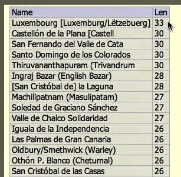
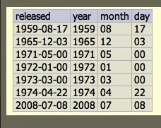

## 04_01. Строки в SQL

В стандарте используются одинарные кавычки. Две одинарные кавычки подряд позволяют напечатать одинарную кавычку как таковую.  

## 04_02. Определение длины строки - LENGTH

```sql
SELECT LENGTH('string');
SELECT Name, LENGTH(Name) AS Len FROM City ORDER BY Len DESC;
```


## 04_03. Получение подстроки - SUBSTR

```sql
SELECT SUBSTR('this string', 6);
SELECT released,
    SUBSTR(released, 1, 4) AS year,
    SUBSTR(released, 6, 2) AS month,
    SUBSTR(released, 9, 2) AS day
  FROM album
  ORDER BY released
;
```



## 04_04. Удаление пробелов с помощью функции TRIM

```sql
SELECT '   string   ';
SELECT TRIM('   string   ');
SELECT LTRIM('   string   ');
SELECT RTRIM('   string   ');
SELECT '...string...';
SELECT TRIM('...string...', '.');
```

## 04_05. Преобразование в нижний или верхний регистр

```sql
SELECT 'StRiNg';
SELECT 'StRiNg' = 'string';
SELECT LOWER('StRiNg') = LOWER('string');
SELECT UPPER('StRiNg') = UPPER('string');
SELECT UPPER(Name) FROM City ORDER BY Name;
SELECT LOWER(Name) FROM City ORDER BY Name;
```

---
