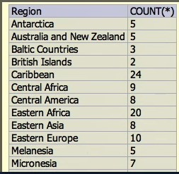
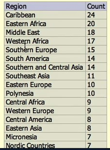
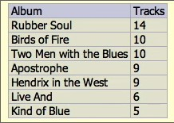
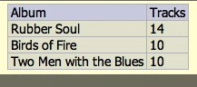

## 07_01. Агрегированные данные. Общие сведения

-- world.db

```sql
SELECT COUNT(*) FROM Country;
-- Result: 239

SELECT Region, COUNT(*)
  FROM Country
  GROUP BY Region
;
```



```sql
SELECT Region, COUNT(*) AS Count
  FROM Country
  GROUP BY Region
  ORDER BY Count DESC, Region
;
```



-- album.db

```sql
SELECT a.title AS Album, COUNT(t.track_number) as Tracks
  FROM track AS t
  JOIN album AS a
    ON a.id = t.album_id
  GROUP BY a.id
  ORDER BY Tracks DESC, Album
;
```


HAVING используется только с агрегированными данными. Его можно понимать как WHERE для агрегированных данных.  

```sql
SELECT a.title AS Album, COUNT(t.track_number) as Tracks
  FROM track AS t
  JOIN album AS a
    ON a.id = t.album_id
  GROUP BY a.id
  HAVING Tracks >= 10
  ORDER BY Tracks DESC, Album
;
```


WHERE добавляет дополнительное условие. Оно указывается до HAVING.  

```sql
SELECT a.title AS Album, COUNT(t.track_number) as Tracks
  FROM track AS t
  JOIN album AS a
    ON a.id = t.album_id
  WHERE a.artist = "The Beatles"
  GROUP BY a.id
  HAVING Tracks >= 10
  ORDER BY Tracks DESC, Album
;
```


## 