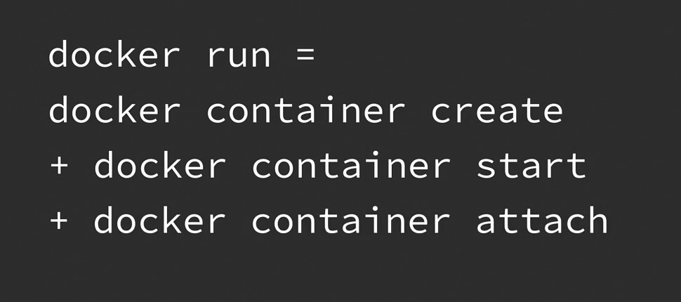

## 013-Exploring the Docker CLI

Справка

    docker --help

Примеры справок по командам

    docker network --help
    docker network create --help

## 014-Create a Docker container. Long way

Справка:

    docker container create --help

Создаёт контейнер. Но не запускает его. Общая форма:

    docker container create [OPTIONS] IMAGE [COMMAND] [ARG...]

> 1.1 Пример запуска hello-world с тегом linux

    docker container create hello-world:linux

Список запущенных контейнеров

    docker ps

Список всех контейнеров

    docker ps --all

> 1.2 Запуск контейнера

    docker container start Container_id

> 1.3 Посмотреть логи контейнера

    docker logs Container_id(or_first_3_characters_of_id)

----

> 2. Одной командой посмотреть производимый контейнером вывод в терминал, даже если контейнер закрывается автоматически (не содержит в себе долгоиграющий процесс):

    docker container start --attach 3_symbols_of_container_id

## 015-Create a Docker container. The short way

    docker run hello-world:linux

Будет создан, запущен контейнер и выведен результат на терминал. Контейнер закроется автоматически, если в нем нет долгоиграющего процесса.



    docker ps --all

покажет все существующие контейнеры.

    docker logs Container_id(or_first_3_characters_of_id)

покажет вывод контейнера в терминал, записанный в логи.  

> До сих пор создавался контейнер из образов DockerHub. Далее будут рассмотрены создание контейнеров из своих созданных образов.

## 016-Create a Docker container from Dockerfiles part 1

https://github.com/mszahan44/learning-docker

В рабочей папке создаются два файла - Dockerfile и entrypoint.bash .

// Dockerfile:    

```ruby
    FROM ubuntu  # основа образа локально или с DockerHub

    LABEL maintainer="Carlos Nunez <dev@carlosnunez.me>"

    USER root    # Под каким пользователем будут выполнены следующие команды

    COPY ./entrypoint.bash /  # Context - то, что будет скопировано в образ

    # Инструкции RUN настраивают образ, устанавливают программы
    RUN apt -y update
    RUN apt -y install curl bash 
    RUN chmod 755 /entrypoint.bash

    # Установка пользователя, который будет применён по умолчанию
    USER nobody

    # Точка входа - какие команды должны выполняться при запуске контейнера.
    # Возможно применение CMD вместо ENTRYPOINT
    ENTRYPOINT [ "/entrypoint.bash" ]
```

// entrypoint.bash:  

```bash
#!/usr/bin/env bash

bash_is_current_version() {
  bash --version | grep -q 'version 5'
}

curl_is_installed() {
  &>/dev/null which curl &&
    curl --version | grep -q '^curl'
}

get_current_date() {
  curl --silent --insecure -I google.com |
    grep -E '^Date' |
    sed 's/^Date: //' 
      xargs -I {} date --date='{}'
}

if ! bash_is_current_version
then
  >&2 echo "ERROR: Bash not installed or not the right version."
  exit 1
fi

if ! curl_is_installed
then
  >&2 echo "ERROR: Curl is not installed."
  exit 1
fi

echo "Hello! The current date and time is $(get_current_date)"
```

## 017-Create a Docker container from Dockerfiles part 2

    docker build --help
    
> Создание образа our-first-image.

Контекст - папка, содержащая файлы, которые Docker будет включать в образ. Контекст указывается как путь или файл после слова COPY в Dockerfile. Указанные данные будут скопированы в создаваемый образ.  

В данном случае используется файл entrypoint.bash в той же папке, поэтому ставится точка. Иначе потребуется указать путь к папке.

-t или --tag используются для названия образа.   

    docker build -t our-first-image .

Если используется имя файла не Dockerfile, а другое, то используется -f или --file для указания другого файла    

    docker build -t our-first-image --file MyFile .

> Запустить контейнер из образа

    docker run our-first-image
  
> До этого запускались контейнеры, которые сразу останавливались. Далее будут расмотрены контейнеры, которые не перестают работать после запуска.  

## 018-Interact with your container

> Создание образа our-first-server из файла server.Dockerfile

// server.Dockerfile:

```ruby
    FROM ubuntu
    LABEL maintainer="Carlos Nunez <dev@carlosnunez.me>"

    USER root
    COPY ./server.bash / 

    RUN chmod 755 /server.bash
    RUN apt -y update
    RUN apt -y install bash

    USER nobody

    ENTRYPOINT [ "/server.bash" ]
```

Вспомогательный файл server.bash должен быть в кодировке unix, иначе будут ошибки.  

// server.bash:  

```ruby
#!/usr/bin/env bash

bash_is_current_version() {
  bash --version | grep -q 'version 5'
}

start_server() {
  echo "Server started. Press CTRL-C to stop..."
  while true
  do sleep 10
  done
}

if ! bash_is_current_version
then
  >&2 echo "ERROR: Bash not installed or not the right version."
  exit 1
fi

start_server
```

Команда: 

    docker build --file server.Dockerfile --tag our-first-server .


> Запуск контейнера из образа our-first-server

- 1 Вариант. Можно считать ошибочным.  

Если запустить контейнер в одном терминале,

    docker run our-first-server

то придётся убивать его в другом: 

    docker ps    # узнать id
    docker kill cntr_id

и будет получена ошибка выхода:

    Exited(137)

Такое поведение происходит потому, что docker прикрепляет (attach) текущий терминал к контейнеру и не даёт из него выбраться. Контейнеры по умолчанию не являются интерактивными, то есть после запуска в терминале не реагируют на нажатия клавиш.  

- 2 Вариант. Контейнер запускается, но его не видно.  

Чтобы контейнер не блокировал работу одного терминала, следует запускать контейнер иначе (c detach):

    docker run -d our-first-server

Либо, что дольше, можно запустить

    docker container create
    docker container start

Эти команды создадут и запустят контейнер, но не прикрепят ваш терминал к работающему контейнеру, то есть не будет видно работающего контейнера.

Чтобы проверить, что контейнер работает, можно набрать  

    docker ps

Или запустить некоторые команды для работающего контейнера, например, так:  

    docker exec container_id date

 - 3 Вариант. Взаимодействие с контейнером в терминале

Чтобы войти в контейнер, запустить в нём оболочку bash и таким образом сразу взаимодействовать с ним в текущем терминале:

    docker exec --interactive --tty container_id bash

Чтоб выйти из контейнера:

    ctrl + d

## 019-Stopping and removing the container

Посмотреть все контейнеры

    docker ps -a

### Остановка

Остановка контейнера (занимает некоторое время)

    docker stop fd69

Срочная остановка контейнера (может привести к потерям данных)

    docker stop -t 0 cntr_id

### Удаление

Удаление ненужного контейнера

    docker rm cntr_id

Сначала остановить работающий контейнер, а потом удалить его:  

    docker rm -f cntr_id

> Удаление всех контейнеров

Показать все id всех контенйеров

    docker ps -aq 

Удаление всех контейнеров. Знак трубы означает передачу выходных данных из команды слева в команду справа. xargs - команда Linux, а не Docker.

    docker ps -aq | xargs docker rm

> Удаление образов

Список образов

    docker images

Удаление образа. Контейнеры должны быть остановлены.

    docker rmi img_name

## 020-Binding ports to your container

// web-server.Dockerfile

```ruby
FROM ubuntu
LABEL maintainer="Carlos Nunez <dev@carlosnunez.me>"

USER root
COPY ./web-server.bash /

RUN chmod 755 /web-server.bash
RUN apt -y update
RUN apt -y install bash netcat

USER nobody

ENTRYPOINT [ "/web-server.bash" ]
```

// web-server.bash

Обязательно в кодировке Unix !
Ошибки даже может не быть на экране, но docker и linux не понимают windows кодировки и его переноса строк. Из-за этого файл bash может иметь невидимые переносы строк (r/n/), которые могут быть расценены как часть команд (r/ как команда), из-за чего в итоге файл bash становится нерабочим.

```bash
#!/usr/bin/env bash

start_server() {
  echo "Server started. Visit http://localhost:5000 to use it."
  message=$(echo "<html><body><p>Hello! Today's date is $(date).</p></body></html>")
  length=$(wc -c <<< "$message")
  payload="\
HTTP/1.1 200 OK
Content-Length: $((length-1))

$message"
  while true
  do echo -ne "$payload" | nc -l -p 5000
  done
}

start_server
```

Создание образа

    docker build -t our-web-server -f web-server.Dockerfile .

Создание и Запуск контейнера

    docker run -d --name our-web-server our-web-server

Просмотр работающих контейнеров 

    docker ps

Посмотреть логи по имени контейнера

    docker logs our-web-server

Остановка и Удаление работающего контейнера одной командой

    docker rm -f our-web-server

вместо использования нескольких команд

    docker stop && docker rm

> Создание контейнера с проброской портов. Сначала следует порт хоста, потом контейнера.

    docker run -d --name our-web-server -p 5001:5000 our-web-server

После этого возможен запуск html-страницы, созданной в bash, на машине хоста

    http://localhost:5001

## 021-Saving data from containers

Создание контейнера, файла в контейнере и удаление контейнера

    docker run --rm --entrypoint sh ubuntu -c "echo 'Hello there.' > /tmp/file && cat /tmp/file"

Проверка созданного файла на хосте. Он не существует  

    cat /tmp/file

Чтобы сопоставить и сохранить данные на хосте (и в контейнере), используются команды -v или --volume. Слева от двоеточия будет папка на хосте, справа - в контейнере.  

    docker run --rm --entrypoint sh -v /tmp/container:/tmp ubuntu -c "echo 'Hello there.' > /tmp/file && cat /tmp/file"

Убеждаемся, что файл существует на хосте (компе):  

    cat /tmp/container/file  

Можно сопоставить файл с файлом. change_this_file и file 

    # создать файл
    touch /tmp/change_this_file

    docker run --rm --entrypoint sh -v /tmp/change_this_file:/tmp/file ubuntu -c "echo 'Hello there.' > /tmp/file && cat /tmp/file"

    # убедиться, что файл на компе изменён
    cat /tmp/change_this_file

Если мы попытаемся сопоставить несуществующий файл на компе (слева от двоеточия) с контейнером, то контейнер создаст на этом месте в компе папку вместо файла, и синхронизированно создаст папку в контейнере.  

## 022-Introducing the Docker Hub


