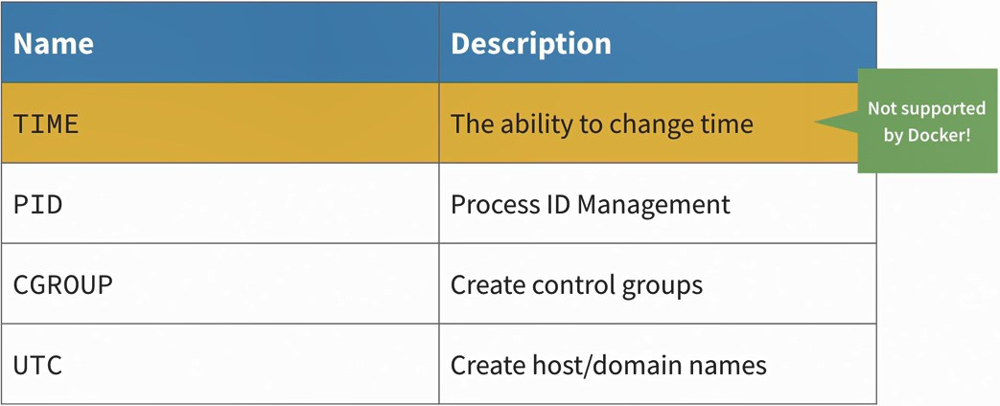
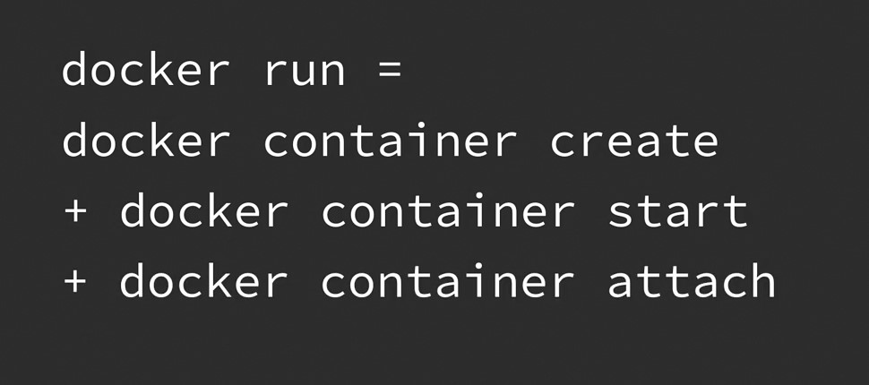

## 006-The anatomy of a container

8 пространств имён в Linux:

## 11-Hello-world on Windows

Инфо:

    docker

Список контейнеров:

    docker ps

Получить hello-world:

    docker run hello-world

## 12-Install on Linux

1 - Установить curl 

    sudo apt install curl

2 - Загрузить установочный скрипт Docker

    curl -o /tmp/get-docker.sh https://get.docker.com

3 - Запустить скачанный сценарий

    sh /tmp/get-docker.sh

Движок Докера установлен.

> Запуск hello-world в Линукс

    sudo docker run hello-world

### Чтобы не набирать sudo постоянно:  

>  Добавить пользователя в группу docker, чтобы не набирать sudo постоянно. 

Через переменную:

    sudo usermod -aG docker $USER

или известное имя пользователя:

    sudo usermod -aG docker myusername

> Перезагрузить для вступления изменений в силу. 

Или же, не перезагружая:

    su -s $USER
    
Или, для переключения на получившего новую группу пользователя,

    sudo -u myusername sh

Посмотреть группы:
    
    groups
    
> Далее, запустить docker hello-world без sudo

    docker run hello-world

## 013-Exploring the Docker CLI

Справка

    docker --help

Примеры справок по командам

    docker network --help
    docker network create --help

## 014-Create a Docker container. Long way

Справка:

    docker container create --help

Создаёт контейнер. Но не запускает его. Общая форма:

    docker container create [OPTIONS] IMAGE [COMMAND] [ARG...]

Пример запуска hello-world с тегом linux

    docker container create hello-world:linux

Список запущенных контейнеров

    docker ps

Список всех контейнеров

    docker ps --all

Запуск контейнера

    docker container start Container_id

Посмотреть логи контейнера

    docker logs Container_id(or_first_3_characters_of_id)

----

Посмотреть производимый контейнером вывод в терминал, даже если контейнер закрывается автоматически (не содержит в себе долгоиграющий процесс):

    docker container start --attach 3_symbols_of_container_id

## 015-Create a Docker container The short way

    docker run hello-world:linux

Будет создан, запущен контейнер и выведен результат на теминал. Контейнер закроется автоматически, если в нем долгоиграющего процесса.

    docker ps --all

покажет все существующие контейнеры.

    docker logs Container_id(or_first_3_characters_of_id)

покажет вывод контейнера в терминал, записанный в логи.  

  

