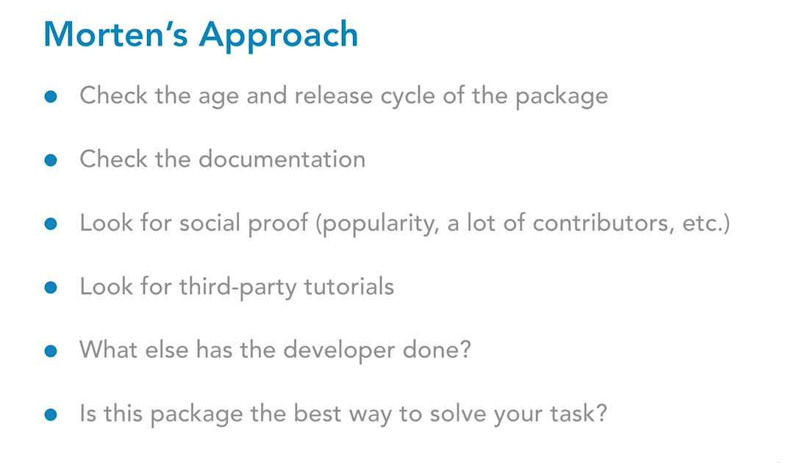

 Introduction Welcome 52s  
 Exercise files 46s  
 
 1. Introduction to Composer  

 What is Composer? 1m 54s  
 Mac: Run PHP 1m 13s  
 Mac: Install Composer 2m 58s  
 Windows: Run PHP 2m 6s  
 Windows: Install Composer 4m  

 2. Using Composer  

 Get ready to use Composer 2m 54s  
 Add Composer to a project 3m 17s  
 Find packages for Composer 3m 50s  
 Add a Composer package 3m 57s  
 Use packages in a project 8m 9s  
 Version management 2m 50s  
 The purpose of composer.lock 3m 34s  
 Update Composer packages 4m 57s  
 Useful Composer commands 2m 56s  
 
 3. Composer in Production  

 Use Composer with version control 2m 49s  
 Set up a project already using Composer 2m 8s  
 What packages should you trust? 3m 42s  
 Conclusion Thank you 1m 3s

---

# 03. Using Composer

## 03_02-Add Composer to a project

Запустить создание composer.json в текущей папке

     composer init

## 03_03-Find packages for Composer

https://packagist.org/

## 03_04-Add a Composer package

    composer require league/color-extractor

## 03_05-Use packages in a project

Когда в проекте нет папки `vendor` следует запустить установку пакетов, от которых зависит проект. Для этого достаточно иметь в папке проекта файл composer.json с перечисленными зависимостями.

    composer install

Используется в проекте

https://packagist.org/packages/league/color-extractor

https://github.com/thephpleague/color-extractor

## 03_06-Version management

https://getcomposer.org/doc/articles/versions.md

```json
"require": {
    "vendor/package": "1.3.2", // exactly 1.3.2

    // >, <, >=, <= | specify upper / lower bounds
    "vendor/package": ">=1.3.2", // anything above or equal to 1.3.2
    "vendor/package": "<1.3.2", // anything below 1.3.2

    // * | wildcard
    "vendor/package": "1.3.*", // >=1.3.0 <1.4.0

    // ~ | allows last digit specified to go up
    "vendor/package": "~1.3.2", // >=1.3.2 <1.4.0
    "vendor/package": "~1.3", // >=1.3.0 <2.0.0

    // ^ | doesn't allow breaking changes (major version fixed - following semver)
    "vendor/package": "^1.3.2", // >=1.3.2 <2.0.0
    "vendor/package": "^0.3.2", // >=0.3.2 <0.4.0 // except if major version is 0
}
```

## 03_07-The purpose of composer.lock

https://packagist.org/packages/monolog/monolog

Установка конкретной версии

    composer require monolog/monolog:1.17.0

## 03_08-Update Composer packages

Посмотреть устаревшие версии в проекте

    composer outdated

В composer.json можно поменять требования к версиям в секции require.

Обновить. Если нужно обновить все - то постащик/пакет не указывается.

    composer update monolog/monolog

Посмотреть список всех пакетов в проекте

    composer show

## 03_09-Useful Composer commands

Внедрение composer в проект

    composer init

Устанавливает все зависимости в проект на основе файлов composer.lock или composer.json

    composer install

Загрузка пакета в проект

    composer require [vendor/package]

Установка пакета только для целей разработки (development)  

    composer require --dev [vendor/package]

Показывает информацию об установленных пакетах

    composer show

Просмотр устаревших пакетов

    composer outdated

Обновление пакетов согласно версионности в composer.json

    composer update

Обновление конкретного пакета согласно файлу composer.json  

    composer update [vendor/package]

Удалить конкретный пакет и его зависимости (если зависимости применимы только к этому пакету)

    composer remove [vendor/package]

Посмотреть список доступных команд

    composer

---

# 04. Composer in Production

## 04_01-Use Composer with version control

Папку vendor всегда добавлять в .gitignore, т.к. вместо неё используются composer.json и composer.lock

    /vendor/

## 04_02-Set up a project already using Composer

Установка проекта из папки, где нет папки vendor, но есть файл composer.lock или composer.json

    composer install

## 04_03-What packages should you trust



---