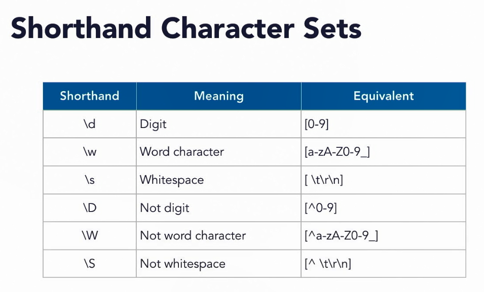
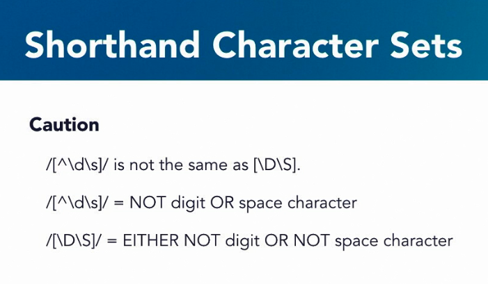
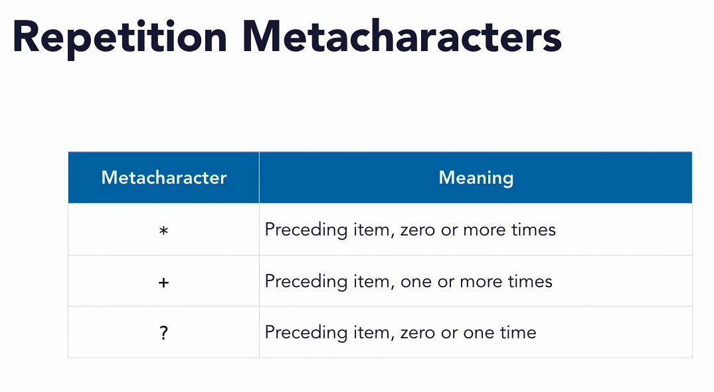
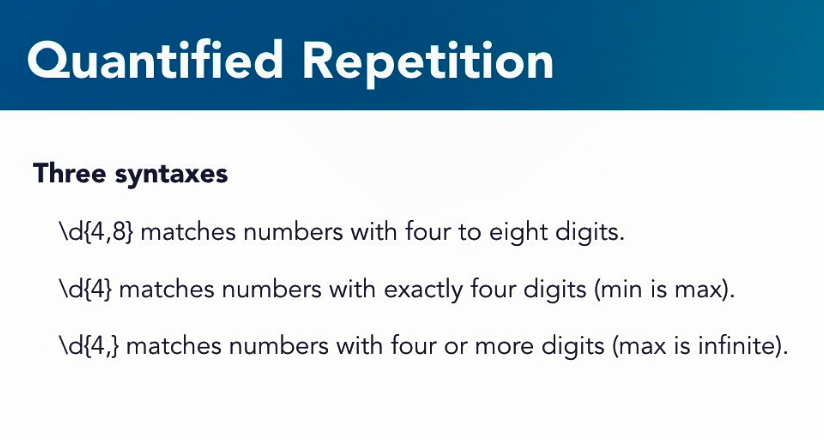
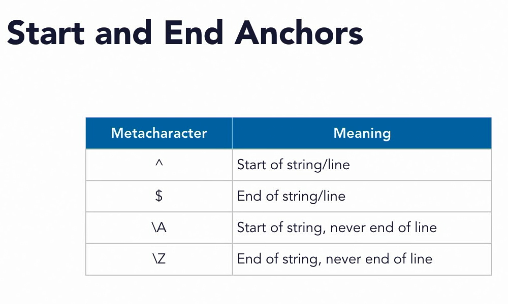
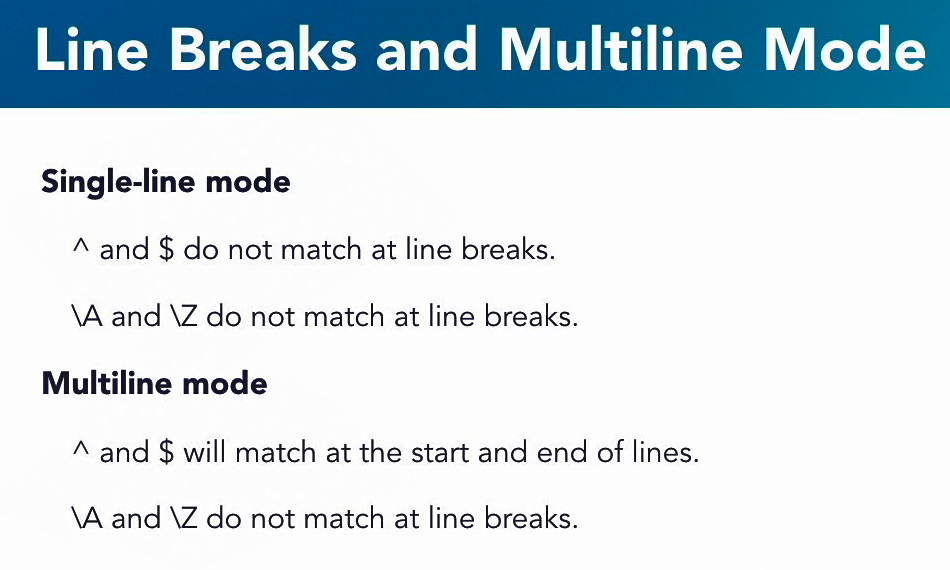

## 003-Choose a regular expression engine

regexr.com

regex101.com

regexpal.com

## 016-Shorthand character sets

## 019 Repetition metacharacters

## 020 Quantified repetition

## 030 Start and end anchors

abcdefghijklmnopqrstuvwxyz

apples to apples to apples

\w+@\w+\.[a-z]{3}  
someone@nowhere.com

^\w+@\w+\.[a-z]{3}$  
someone@nowhere.com-junk

## 031-Line breaks and multiline mode

[a-z ]+  
milk  
apple juice  
sweet peas  
yogurt  
sweet corn  
applesauce  
milkshake  
sweet potatoes  

 
line - это одна строка (ряд) в документе,  
string - это строковое представление всего, файл целиком.  

