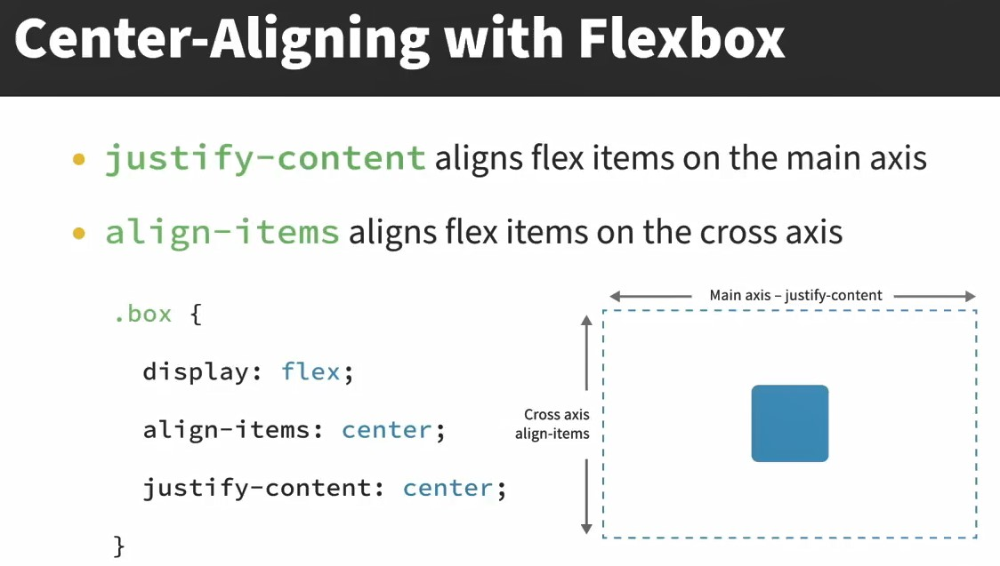

# Linkedin CSS Essential Training 08-2023

CSS Essential Training (2023)
https://codepen.io/collection/YyadbL

## Links

Lorem ipsum   
https://meettheipsums.com/

Photos  
https://unsplash.com/  
https://picsum.photos/ - прямые ссылки на фото, но не работает в РФ

Icons  
https://www.iconfinder.com/  
https://www.freepik.com/

Изменять размер изображений  
https://www.adobe.com/express/   
https://www.shutterstock.com/   

W3C - Functional Images  
https://www.w3.org/WAI/tutorials/images/functional/

W3C - CSS  
https://www.w3.org/Style/CSS/  
https://www.w3.org/Style/CSS/Overview.ru.html

https://www.w3.org/Style/CSS/current-work


## 016-CSS syntax and terminology

Shorthand properties

    padding: 10px 5px 20px 15px;
    /* top, right, bottom, left */

Longhand properties

    padding-top: 10px;
    padding-right: 5px;
    padding-bottom: 20px;
    padding-left: 15px;

Comments

    /* line */
    /* lines
       lines
    */

Style of code

https://codeguide.co/

## 017-CSS values and units

https://developer.mozilla.org/en-US/docs/Web/CSS/CSS_Values_and_Units

## 018-The color property and values

Имена цветов

https://developer.mozilla.org/en-US/docs/Web/CSS/named-color

Цвета по группам

https://colours.neilorangepeel.com/

Шестнадцетиричная прозрачность

https://davidwalsh.name/hex-opacity

Как вычислять шестнадцетиричные значения

https://www.wikihow.com/Understand-Hexadecimal

Все типы создания цветов

https://developer.mozilla.org/en-US/docs/Web/CSS/color_value


## 019-Creating a color palette

Выбор набора цветов

https://coolors.co/ -  
Надо нажать кнопку "Start the Generator" и перебирать набор цветов нажатием пробела. Понравившиеся цвета можно отметить неизменными, нажав знак замочка.  

## 020-Type and universal selectors

Универсальный селектор, применяется сразу ко всем html-элементам

    * {
        /* styles */
    }

## 021-ID selectors

html
  
    <h1 id="light">...</h1>

css

    #light {
        bckground: yellow;
    }

## 022-Class selectors

html. Применяются два класса сразу

    <p class="fancy light">...</p>

css

   
    .fancy.light {
        border: 1px solid black;
    }

combined css

    h1#intro {
        ...
    }

    p.intro {
        ...
    }

## 023-Descendant combinators and selector lists

Выбор вложенного тега

css

    section p {
        ...
    }

html

    <section>
      <p>...</p>
    <section>

Сгруппированы, чтобы не перечислять поштучно. 

css

    h1, h2, h3 {
        ...
    }

## 024-The background property

https://codepen.io/christinatruong/pen/OJBbdLw/

https://developer.mozilla.org/en-US/docs/Web/CSS/background

## 026-Project Adding background styles

https://www.webfx.com/web-design/hex-to-rgb/


## 027-Pseudo classes and pseudo elements

02_13 Pseudo-classes and pseudo-elements  
https://codepen.io/christinatruong/pen/jOeyPPR

https://developer.mozilla.org/en-US/docs/Web/CSS/:active

## 029-Specificity

Пример высчитывания специфичности


## 032-The box model properties


https://developer.mozilla.org/en-US/docs/Web/CSS/border-width


## 033-Box sizing and the box model fix

Разница в вычислении размера контента:


03_03 Box-sizing  
https://codepen.io/christinatruong/pen/bGxvOeG

`border-box` не изменяет размеры элементов, в отличие от `content-box`.  

Исправление коробочной модели:  

```css
/*
https://www.paulirish.com/2012/box-sizing-border-box-ftw/
*/

html {
  box-sizing: border-box;
}

*, *:before, *:after {
  box-sizing: inherit;
}
```

## 034-Inline block and display

03_04 Inline, block and display  
https://codepen.io/christinatruong/pen/xxaYNLK


## 036-Debugging with developer tools

Рекомендуемый курс:

> Workflow Tools for Web Developers

## 037-Managing box model quirks

03_07 Box model quirks   
https://codepen.io/christinatruong/pen/QWVmjZW


## 044-Layouts with the float property

04_02 Floats

https://codepen.io/christinatruong/pen/JjaZJeK

## 045-Clearing floats

В плавающих элементах часто получалось, что контент выходил за пределы отведённого размера элемента. Чтобы избежать этого есть несколько способов.  

Первый способ: overflow 

overflow: hidden; - скрывает часть контента, который вышел за пределы элемента.  
overflow: auto; - появляется полоса прокрутки, когда контент вышел за пределы элемента.

```html
    <div class="parent">
        <div class="floated">floated element</div>
        <div class="floated">floated element</div>
    </div>

    .floated {
        float: left;
    }

    .parent {
        overflow: hidden;
        /* OR */
        overflow: auto;
    }

```

Способ Clearfix Hack. Устарел. В основном требовался из-за Internet Explorer.

Самый современный способ: display. Заставляет контент полностью входить в контейнер, не выходя за его пределы. Видимо, повторяет поведение flex и grid.  

```html
    .parent {
        display: flow-root;
    }

    <div class="parent">
        <p>floated element</p>
        <p>floated element</p>
    </div>

```

## 047-The position property

https://codepen.io/christinatruong/pen/OJowQEV

## 048-Position and z index

04_06 position and z-index  
https://codepen.io/christinatruong/pen/YzOjLgv

z-index можно указывать с любыми числами. Чем больше число, тем выше (нагляднее, ближе к нам) позиционируется эдемент. С z-index'ом нужно указать `position:realtive;`

```css
position: realtive;
z-index: 2;
```

## 052-Flexbox Orientation and ordering

```css
.container {
  display: flex;
  /* направление выравнивания */
  flex-direction: row;
                column;
                row-reverse;
                column-reverse;
  /* распределяет элементы в строку*/
  flex-wrap: nowrap;
  /* или переносит их на новую строку при необходимости*/
  flex-wrap: wrap;

  /* Shorthand: direction + wrap */
  flex-flow: column wrap;
}

```

```html
<div class="container">
  <div>flex item</div>
  <div>flex item</div>
  <div>flex item</div>
</div>
```

## 053-Sizing with flex properties

```css
/* Shorthand */
flex: 0 1 auto;

/* Longhand */
/* как заполняется пространство,
   0 по умолчанию - дополнительное пространство не заполняется,
   1 - заполняется вся строка элементами flex-item */
flex-grow: 0;

/* как сжимаются flex-элементы в контейнере,
   1 по умолчанию - элементы уменьшаются на одинаковую величину
   0 - сжатие элементов отменяется,
    и элементы могут выйти за границы контейнера, 
    если не прменялся flex-wrap */
flex-shrink: 1;

/* Устанвливает изначальный размер flex-элементов 
   auto по умолчанию - элементы заполняют прсотанство согласно своему контенту,
   100px - все остальные значения можно утсанавливать в пикселях  *,
   с этим элементом часто ипользуют 
   box-sizing: border-box; 
   вместо 
   box-sizing: content-box; */
flex-basis: auto;

```

Применение
```css

.flex-container {
    display: flex;
}

.flex-items {
    /* flex-grow | flex-shrink | flex-basis */
    flex: 0 1 auto;
}

<div class="flex-container">
    <div class="flex-item">1</div>
    <div class="flex-item">2</div>
    <div class="flex-item">3</div>
    <div class="flex-item">4</div> 
</div>

```

## 054-Flexbox exercise

05_05 Intro to Flexbox  
https://codepen.io/christinatruong/pen/ZEMMqmy

## 056-Aligning flex items

 

Пример  

 https://codepen.io/christinatruong/pen/eYLPGZJ

```html
<ul>
  <li>One</li>
  <li>Two</li>
  <li>Three</li>
</ul>
```
css - частично. Часто используемые свойства.  

```css
ul {
  width: 500px;
  height: 250px;
/*   display: flex; */
/*   justify-content: flex-start; */
/*   justify-content: flex-end; */
/*   justify-content: center; */
/*   justify-content: space-between; */
/*   justify-content: space-around; */
/*   justify-content: space-evenly; */
/*   align-items: stretch; */
/*   align-items: center; */
/*   align-items: flex-start; */
/*   align-items: flex-end; */
}
```

## 059-The explicit grid

Creating a grid

```css
.grid-container {
    display: grid;
    grid-template-columns: 25% 50% 25%; /* Three columns */ 
    grid-template-rows: 100px 100px; /* Two rows */
}
```

fr and repeat()

```css
/* Syntax*/
repeat(number of tracks, size of trcks)

grid-template-columns: 1fr 1fr 1fr;
/* Same as */
grid-template-columns: repeat(3, 1fr);

/* первый столбец займёт 50 px, остальные 2 займут поровну пространство*/
grid-template-columns: 50px repeat(2, 1fr);

```

Пример для тренировки:  
05_10/05_11 The explicit and implicit grid  
https://codepen.io/christinatruong/pen/RwYqGGa  

## 060-The implicit grid

Если заранее не известно точное количество строк и столбцов в сетке, следует использовать свойства, создающие неявную (возможную) сетку:  

    grid-auto-rows
    grid-auto-columns

Пример

```css
.grid-container {
  border: 4px solid black;
  display: grid;
  grid-template-columns: 100px 100px 100px;
  grid-template-rows: 200px;

  /* все будущие строки займут по 100px в высоту*/
  grid-auto-rows: 100px;
}
```

## 061-Adding gutters with the gap property

Создание желобка между строками и колонками

    gap: 10px;

Создание желобка между строками 10px и колонками 30px (shorthand)

    gap: 10px 30px;

Также есть подробное (longhand) выражение

    row-gap: 10px;
    column-gap: 20px;

## 064-Changing fonts with font family

Статистика предустановленных шрифтов на операционных системах - так называемые Web Safe Fonts:

https://www.cssfontstack.com/

Распространённые наборы шрифтов - Modern Font Stacks:

https://github.com/system-fonts/modern-font-stacks

## 065-Font weight and font style

Жирность шрифта. Не все варианты могут использоваться в конкретном шрифте.  

```css
font-weight: 100; /* Lightest or thinnest */
font-weight: 200; /* Extra light or ultra light */
font-weight: 300; /* Light or book */
font-weight: 400; /* Normal or regular */
font-weight: 500; /* Medium */
font-weight: 600; /* Semi bold or demi bold */
font-weight: 700; /* Bold */
font-weight: 800; /* Extra bold or Ultra bold */
font-weight: 900; /* Darkest or thickest */
```

Стиль шрифта

```css
font-style: italic;  /* Курсив */
font-style: oblique; /* Наклон */
font-style: normal;  /* Стандарт */
```

## 066-Web fonts with font face

Как загружаются с сайтом веб-шрифты

```css
/* Объявление */
@font-face {
    font-family: "My Font";
    src:  url("my-font.woff2") format("woff2"),
          url("my-font.woff") format("woff");
}

/* Использование */
body {
    font-family: "My Font", Helvetica, Arial, sans-serif;
}
```

Для старых браузеров и мобильных приложений могут понадобиться не только объявления `woff`. Их можно сгенерировать онлайн:  

https://www.fontsquirrel.com/tools/webfont-generator

## 067-Web fonts with Google Fonts

https://fonts.google.com/

## 


