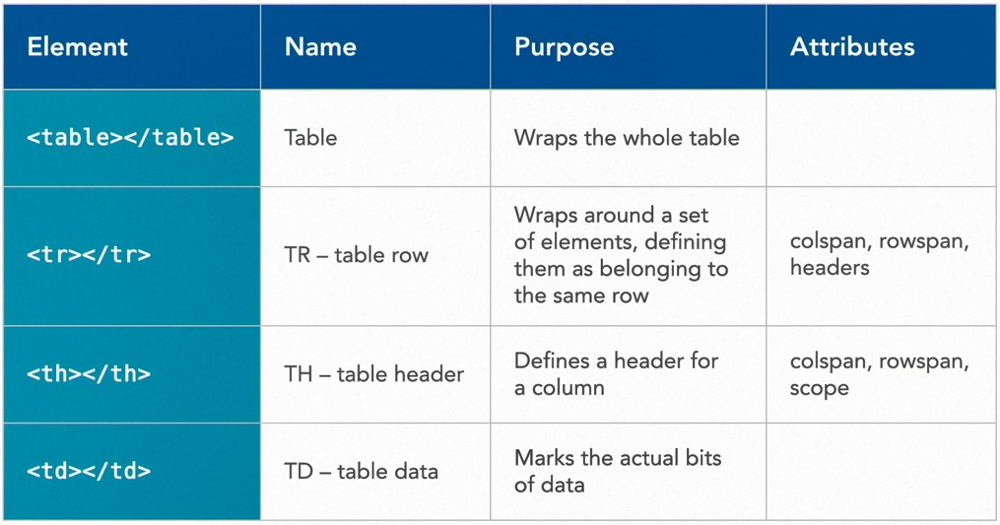

## 039-When to use tables

## 040-Building table rows



Table

```html
<table class="styled">
  <tr>
    <th>Bird</th>
    <th>Color</th>
    <th>Diet</th>
    <th>Photo</th>
  </tr>
  <tr>
    <td>American Goldfinch</td>
    <td>yellow</td>
    <td>Mostly seeds.</td>
    <td></td>
  </tr>
  <tr>
    <td>Bluejay</td>
    <td>blue</td>
    <td>Omnivorous.</td>
    <td></td>
  </tr>
  <tr>
    <td>Indigo Bunting</td>
    <td>blue</td>
    <td>Mostly seeds and insects.</td>
    <td></td>
  </tr>
  <tr>
    <td>Northern Cardinal</td>
    <td>red</td>
    <td>Seeds, insects, berries.</td>
    <td></td>
  </tr>
  <tr>
    <td>Tufted Titmouse</td>
    <td>grey</td>
    <td>Mostly insects.</td>
    <td></td>
  </tr>
</table>
```

# Conclusion

## 041-How to keep learning and HTML specifications

Полезные Ссылки

https://developer.mozilla.org/ru/docs/Web/HTML

https://html.spec.whatwg.org/  
https://html.spec.whatwg.org/multipage/

Текущий стандарт HTML:  
https://html.spec.whatwg.org/dev/  

Про ARIA (области на странице)  
https://w3c.github.io/aria/#aria-describedby

W3C Recomendations  
https://www.w3.org/TR/WCAG21/  

---