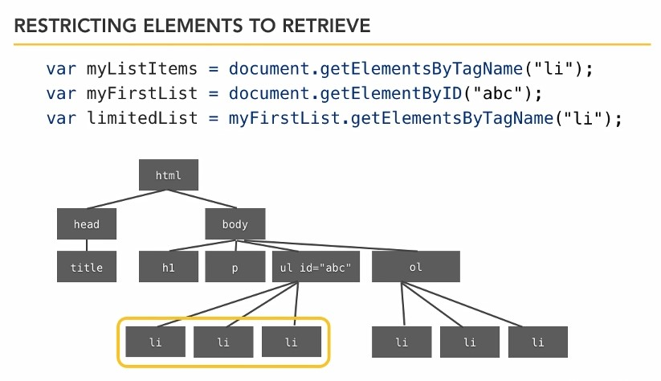
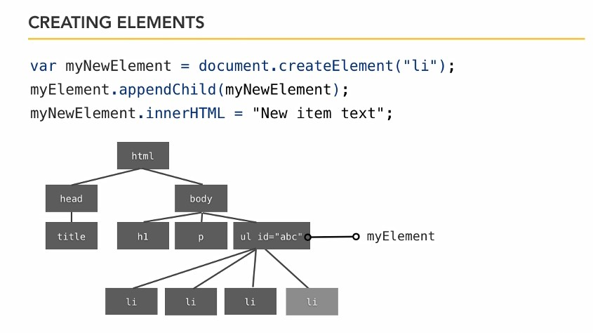
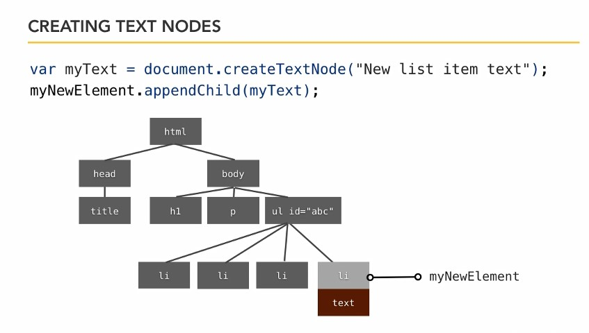
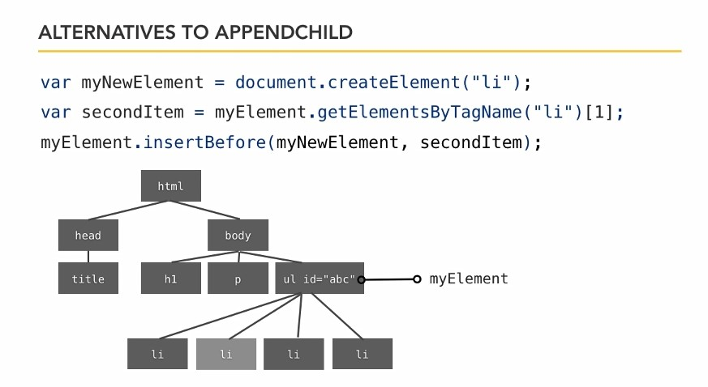

## 5-1 Get elements

    var myElement = document.getElementById("id-name-tag")

    var myListItems = document.getElementsByTagName("li");  // массив

Захват определенного списка



## 5-2 Изменение DOM. Get, Set.

Get. Получить атрибут

    myElement.getAttribute("align");

Set. Задать атрибут

    myElement.setAttribute("align","right");

Примеры.  
```
// <div id="mainContent">
var mainContent = document.getElementById("mainContent");
mainContent.setAttribute("align","right");

// <h1><a id="mainTitle"
var mainTitle = document.getElementById("mainTitle");
console.log(mainTitle.innerHTML);

// <div id="sidebar">
var sidebar = document.getElementById("sidebar");
console.log(sidebar.innerHTML);
```

## 05-3. Создание DOM

Способ создания элемента и текста в нём:



Способ создания текста в элементе. Элемент (тег) и текст внутри элемента - это разные узлы (nodes):



Пример создания через InnerHtml:
```js
//create the elements
var newHeading = document.createElement("h1");
var newParagraph = document.createElement("p");

// to add content, either use innerHTML
newHeading.innerHTML = "Did You Know?";
newParagraph.innerHTML = "California produces over 17 million gallons of wine each year!";

// and we still need to attach them to the document!
document.getElementById("trivia").appendChild(newHeading);
document.getElementById("trivia").appendChild(newParagraph);
```

Пример создания по отдельным узлам элементов и текста
```js
//create the elements
var newHeading = document.createElement("h1");
var newParagraph = document.createElement("p");

// OR create child nodes manually
var h1Text = document.createTextNode("Did You Know?");
var paraText = document.createTextNode("California produces over 17 million gallons of wine each year!");
// and add them as child nodes to the new elements
newHeading.appendChild(h1Text);
newParagraph.appendChild(paraText);

// and we still need to attach them to the document!
document.getElementById("trivia").appendChild(newHeading);
document.getElementById("trivia").appendChild(newParagraph);
```

Альтернатива appendChild. Вставка элемента не в конец списка, а перед другим выбранным элементом :  



##