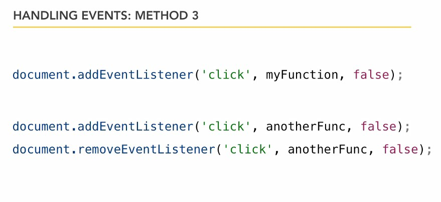
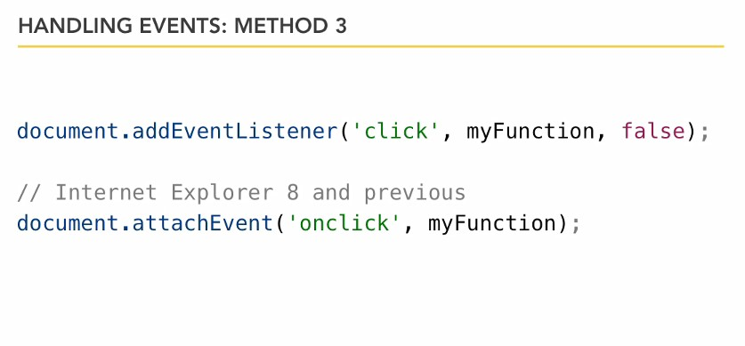

## 06-1. Введение в события

События уже имеют имена в Javascript, они уже встроены в  язык JS. События - это события, клики, перемещения мышки, которые происходят на веб-странице.  

Так пишутся обработчики событий:


Методы обработки событий:  




Когда-то существовали проблемы с кроссбраузреностью:




## 06-2 Клик и загрузка

Примеры onklick

```js
// в документе (на странице)
document.onclick = function() {
	alert("You clicked somewhere in the document");
};

// на изображении
var myImage = document.getElementById("mainImage");
myImage.onclick =  function() {
    alert("You clicked the image");
}

```

Если требуется подтвердить загрузку документа, а потом выполнить событие, например, если js-script находитсяв теге head, то:

```js
function prepareEventHandlers() {	
	var myImage = document.getElementById("mainImage");
	myImage.onclick =  function() {
		alert("You clicked the image");
	}
}

window.onload = function() {
	// prep anything we need to
	prepareEventHandlers();
};

```

## 06-3. Focus и Blur

```js
var emailField = document.getElementById("email");

// При помещении курсора в поле
// текст очищается
emailField.onfocus = function() {
	if ( emailField.value == "your email") {
		emailField.value = "";
	}
};

// При уходе из поля
// появляется текст
emailField.onblur = function() {
	if ( emailField.value == "") {
		emailField.value = "your email";
	}
};
```

## 06-4. Таймеры

Two methods for timers - setTimeout and SetInterval (single / repeating)  

setTimeout  

```js
function simpleMessage() {
	alert("This is just an alert box");
}

// settimeout is in milliseconds
setTimeout(simpleMessage,5000);
```

SetInterval  

```js
var myImage = document.getElementById("mainImage");

var imageArray = ["_images/overlook.jpg","_images/winery_sign.jpg","_images/lunch.jpg","_images/bigSur.jpg","_images/flag_photo.jpg","_images/mission_look.jpg"];
var imageIndex = 0;

function changeImage() {
	myImage.setAttribute("src",imageArray[imageIndex]);
	imageIndex++;
	if (imageIndex >= imageArray.length) {
		imageIndex = 0;
	}
}

// setInterval is also in milliseconds
setInterval(changeImage,5000);
```

Существуют соответственно clearTimeout и clearInterval для остановки перебора элементов.  

```js
var intervalHandle = setInterval(changeImage,5000);

myImage.onclick = function() {
    clearInterval(intervalHandle);
};
```


