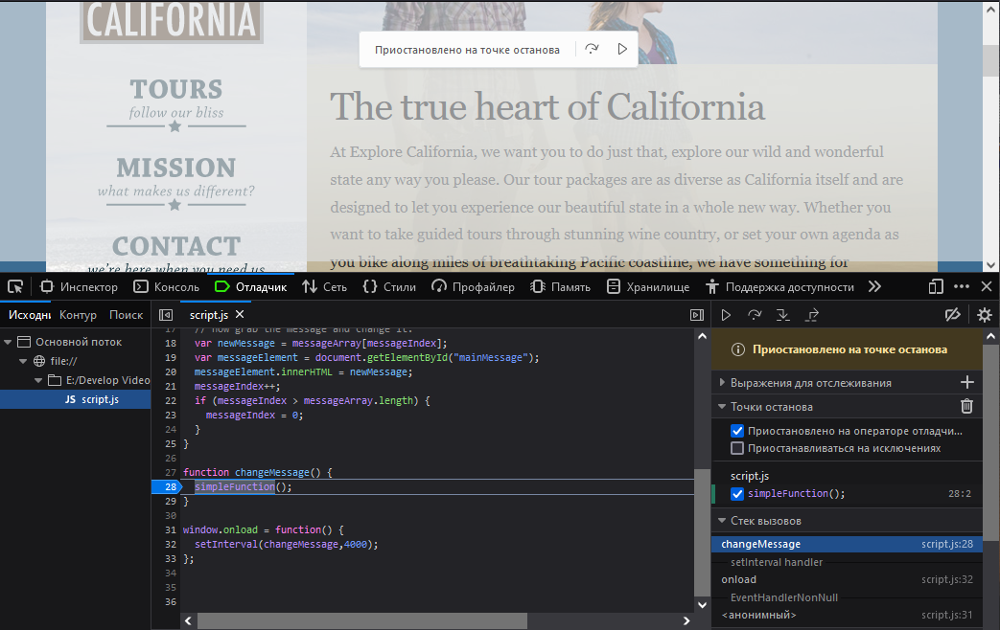
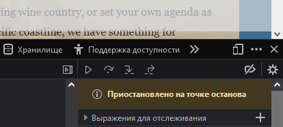
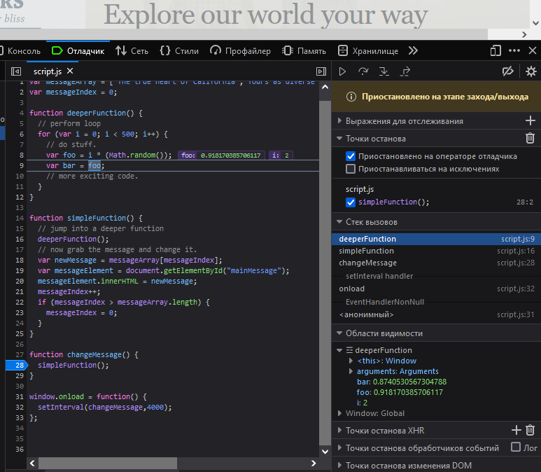
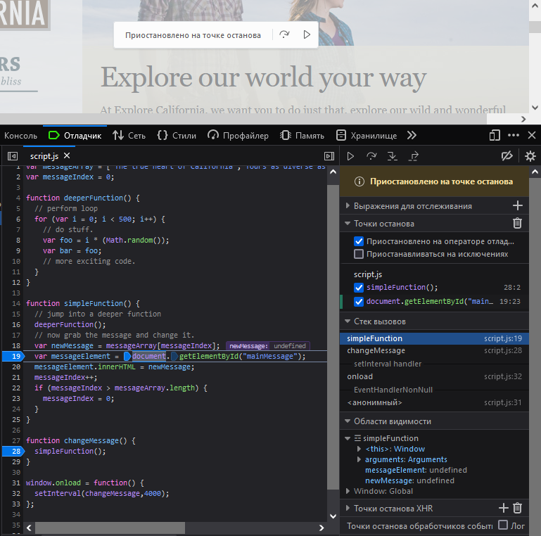
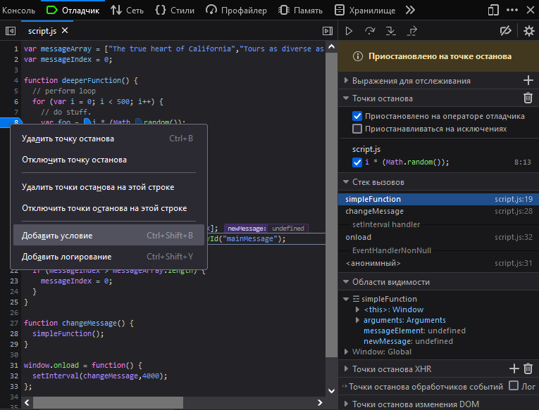
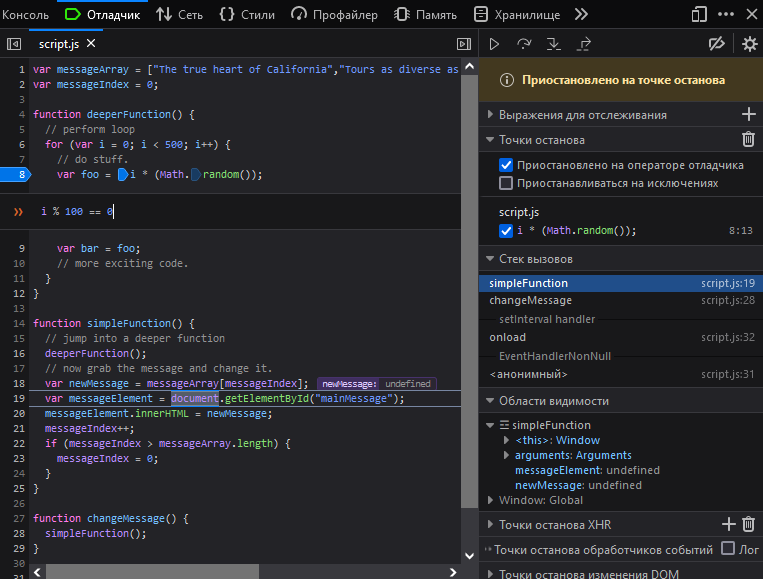
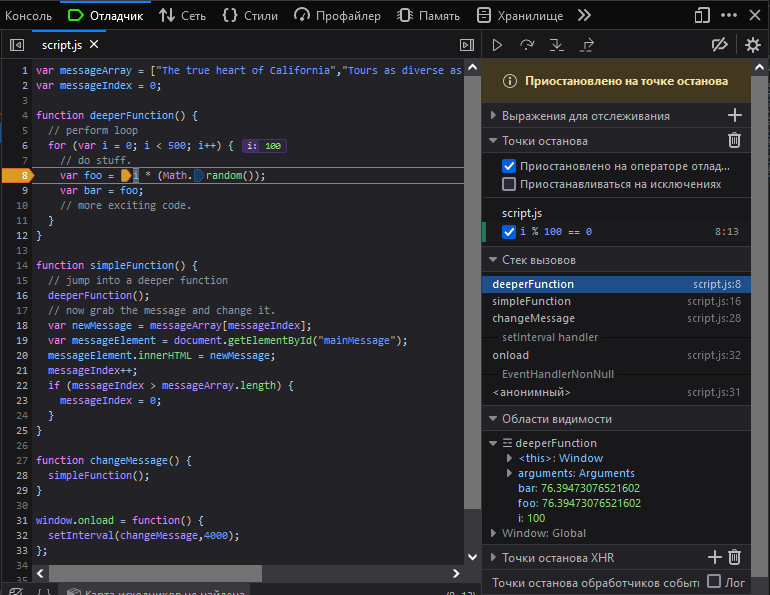

## 07-1. Распространенные ошибки

```js
// Issue 1: Syntax errors

function myFunction() {
	console.log("You called myFunction);
}

window.onload = function() {
	myFunction();
}
```

```js
// Issue 2: calling a non-existent function

function myFunction() {
	console.log("You called myFunction");
}

window.onload = function() {
	myfunction();
}
```

```js
// Issue 2b: typos very common with DOM methods
var x = document.getElementByID("something");

// нужно ...ById
```

```js
// Issue 2c: using a non-existent object method
var myArray = ["one","two","three"];
console.log(myArray.revers);

// нужно ...reverse
```

```js
// Issue 4: using document.getElementById before the element is part of the DOM.
// make sure the DOM is loaded - use window.load
var myImage = document.getElementById("someImage");
```

```js
// Issue 5 - assignment instead of equality
// This is NOT technically an error

var a = 10;
var b = 20;

if ( a = b) { // нужно  ==
	console.log("Something is wrong with the universe.");
} else {
	console.log("This is what I expect!")
}
```

```js
// Issue 6: missing parameters in function calls:
// This is NOT an error - it's just an unexpected result.

function calculateSum(a,b,c) {
	return a + b + c;
}

var result = calculateSum(500,1000);  
// NaN,
// a + b + undefined == NaN, 
// нужно три аргумента
console.log(result);

```

## 07-3. Отладка

```js
// Массив заголовков из трех элементов [0, 1, 2]
var messageArray = ["The true heart of California","Tours as diverse as California itself","Explore our world your way"];
// Счётчик == 0
var messageIndex = 0;

// Функция для демонстрации,
// просто создаёт случайные числа 500 раз
// в процессе выполнения скрипта.
function deeperFunction() {
	// perform loop
	for (var i = 0; i < 500; i++) {
		// do stuff.
		var foo = i * (Math.random());
		var bar = foo;
		// more exciting code.
	}
}

function simpleFunction() {
	// jump into a deeper function
	deeperFunction();

	// now grab the message and change it.
	// Сначала - messageArray[0] == "The true heart of California"
	var newMessage = messageArray[messageIndex];
	// Хватаем id="mainMessage"
	var messageElement = document.getElementById("mainMessage");
	// Вставляем messageArray[0] в этот id
	messageElement.innerHTML = newMessage;
	// Увеличиваем счётчик
	messageIndex++;
	// Когда счётчик больше длины массива, обнуляем счётчик.
	// Проблема возникает, когда 3 > 3,
	// счётчик не обнуляется 
	// и работает далее с messageArray[3], которого нет,
	// результат: undefined .
	if (messageIndex > messageArray.length) {
		messageIndex = 0;
	}
}

// 2. changeMessage запускает simpleFunction
function changeMessage() {
	simpleFunction();
}

// 1. После загрузки страницы вызывается changeMessage каждые 4 секунды
window.onload = function() {
	setInterval(changeMessage,4000);
};
```

### Отладка:

Щелкнуть по строке, чтобы установить точку останова. Код остановится при достижении этой строки.



Кнопки (стрелочки) помогают возбновлять код или перешагивать через точки останова.



F8 Continue Возобновить - Продолжит выполнение до следующей точки останова или, если их нет, запустит код полностью.

F10 Перешагнуть через, Step Over - На заданной строке Выполнить код (функцию) и идти дальше, не заходя в функцию.

F11 Зайти в (Шаг в), Step Into - Выполняет проход по коду пошагово. Основная кнопка.

Shift+F11  Выйти из (Шаг из) Step out - позволяет выйти из цикла или функции, если не требуется проходить все её итерации.  

Работа кнопки F11. При наведении на переменные также будет подсвечиваться их значение:



Использование двух точек останова и кнопки Возобновить F8, чтобы быстро перенестись по точкам и выявить, в какой момент переменная newMessage становится undefined. В данном случае на следующем шаге произойдет отображение undefined на экране.  



### Добавление условий к точкам останова:

Щелкнуть правой кнопкой на точке останова, чтобы получить контекстное меню и добавить условие.



Точка останова сработает (остановится на ней), если выражение будет истинно (true). 



В данном случае точка останова будет срабатывать, когда счётчик i равен 0, 100, 200, 300 и так далее ровно на каждой сотне:



Отключать точки останова - просто нажать на ней, на её строчке. После этого можно запустить код полностью - F8 Возобновить.  

---