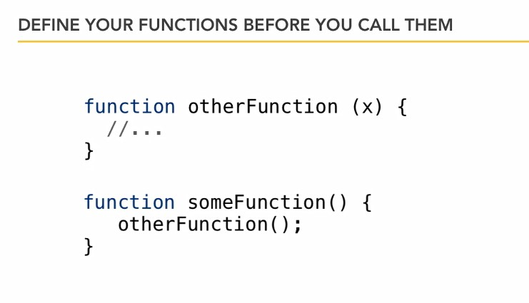
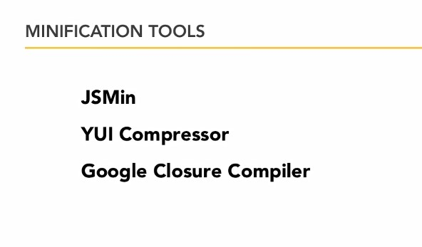

## 10-1. Правила оформления кода

Для переменных и функций используется camelCase .  

При нескольких словах используется тип:  

    глаголСуществительное

Для объектов используется первая заглавная буква.  

Определяйте функции до их вызова.  

## 10-2. Минимизация  

https://closure-compiler.appspot.com/home

Нажимать:  

    Simple - Compile
    // or
    Advanced - Compile  

## 

