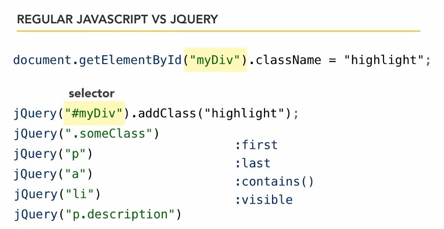

## 11-1. Библиотеки JavaScript

> Библиотеки общего назначения:

Библиотека Closure  
https://developers.google.com/closure?hl=ru  

MooTools  
https://mootools.net/

YUI by Yahoo  
IMPORTANT: The YUI library is no longer actively maintained.
https://clarle.github.io/yui3/  
 
Dojo Toolkit  
https://dojotoolkit.org/

jQuery  
https://jquery.com/

> Специализированные:  

Lightbox2  - Всплывающие изображения
https://cdnjs.com/libraries/lightbox2
http://lokeshdhakar.com/projects/lightbox2/

Script.aculo.us  
Current version: 1.9.0, December 23, 2010.  
https://script.aculo.us/

moo.fx JS library  
https://github.com/kamicane/moofx

curvycorners - закругление углов у div  
https://github.com/donum/curvycorners

## 11-2. Несколько

Несколько скриптов. Обычно ссылки на них располагают в конце страницы. Если есть возможность, их следует совместить в один файл, т.к. каждый файл - это отдельный запрос и ожидание к серверу.   

Порядок расположения имеет значение, потому что вызовы к файлам идут последовательно один за другим. Это важно, если файлы взаимосвязаны или ссылаются друг на друга.  

## 11-3. JQuery

jQuery более гибок, чем JS.  
JS. getElementById работает только с id.  
jQuery работает со всеми селекторами, их сочетаниями и вспомогательными словами.  

JS. className заменяет все существующие классы собой.  
jQuery. addClass добавляет класс к существующим классам.  

Также есть  
.removeClass("highlight")  
.toggleClass("highlight"). Означает, добавить класс, если его нет, и удалить, если он есть.  

Запись jQuery можно заменить на $:  

jQuery("#myDiv").addClass("highlight");  
$("what to find").someAction(any params);  

    // jQuery
    $(document).ready(function () { ... })
    // может использоваться несколько раз на странице
    
    // JS
    window.onload()
    // используется только один раз (последняя написанная функция)

## 11-4. CDN

http://code.google.com/apis/libraries/ ==
https://developers.google.com/speed/libraries?csw=1&hl=ru

Использование протокола http или https на лету с помощью //:  

    

---
