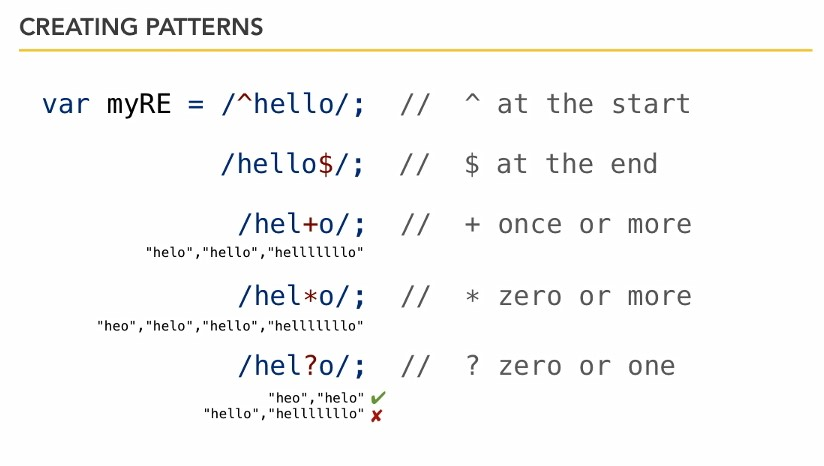

## 13-1. Избегайте это
1

    document.write()

Может разрушить и перезаписать страницу, если в коде будет написан в непоходящем месте.   

2

Код, определяющий, какой браузер используется.

3  

Функция Eval, наподобие exec в других языках.  

```js
var a = "alert('";
var b = "hello world";
var c = "');";

// now, we use eval to combine and execute code dynamically
eval(a + b + c);
```

4

Псевдо-протоколы (Протокол Javascript вместо https)

```html
<p>Inside your HTML, you may find:
    <a href="javascript:some Function ()">this</a> 
</p>
```
Вместо псевдо-протокола следует писать так:  
```html
<p>A preferable way is 
    <a href="nojavascript.html"
       onclick="someFunction (); return false;">this</a>
</p>
```

return false; используется, чтобы не переходить по ссылке по умолчанию, а вызывать функцию. Если JS выключен, будет произведен переход по ссылке.  

## 13-2. Регулярные выражения


CREATE REGULAR EXPRESSIONS

```js
var myRE = /hello/;
// or
var myRE = new RegExp("hello");
var myString = "Does this sentence have the word hello in it?"; 
if(myRE.test(myString) ) {
    alert("Yes");
}
```




## 13-3. Ajax

```js
// Simple Ajax example.

// Создать запрос
// 1: Create the request 
var myRequest;

// Проверка браузера
// feature check!
if (window.XMLHttpRequest) {  // does it exist? we're in Firefox, Safari etc.
    myRequest = new XMLHttpRequest();
} else if (window.ActiveXObject) { // if not, we're in IE
    myRequest = new ActiveXObject("Microsoft.XMLHTTP");
}

// Что делать с ответом от запроса
// 2: create an event handler for our request to call back
myRequest.onreadystatechange = function(){
    console.log("We were called!");
    console.log(myRequest.readyState); // Выводит на консоль номер состояния. Нас интересует 4 - это ответ на запрос от сервера.
    
    // Если ответ получен, то создать параграф и получить текст из файла
    if (myRequest.readyState === 4) {
        var p = document.createElement("p");
        var t = document.createTextNode(myRequest.responseText);
        p.appendChild(t);
        document.getElementById("mainContent").appendChild(p);
    }
};

// Куда отправить запрос
// open and send it
// параметр true - асинхронный режим, код выполняется дальше без ожидания ответа
myRequest.open('GET', 'http://simple.html', true); // http://simple.html  simple.txt

// Отправить запрос
// any parameters?
myRequest.send(null);
```

## 13-4. Прототипы объектов

Есть библиотека Прототип, но она не про прототипы JS.
https://prototypejs.org/

JS по умолчанию не имеет классов. Но встроенная функция prototype позволяет создать подобие создания классов, со свойствами и методами.  

```js
// Simple prototype example

function Player(n) {
    this.name = n;
}

var fred =  new Player("Fred");
```

```js
// Prototype example

// объявление свойств
function Player(n,s,r) {
	this.name = n;
	this.score = s;
	this.rank = r;
}

// объявление методов
Player.prototype.logInfo = function() {
	console.log("I am:" , this.name);
}

Player.prototype.promote = function() {
	this.rank++;
	console.log("My new rank is: " , this.rank);
}

// создание объектов
var fred =  new Player("Fred",10000,5);
fred.logInfo();
fred.promote();

var bob = new Player("Bob",50,1);
bob.logInfo();
bob.promote();

var jane = new Player("Jane",50000,10);
jane.logInfo();
jane.promote();
```

---

