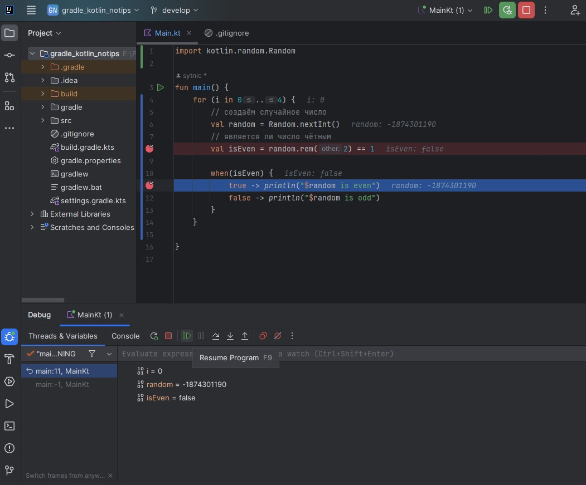
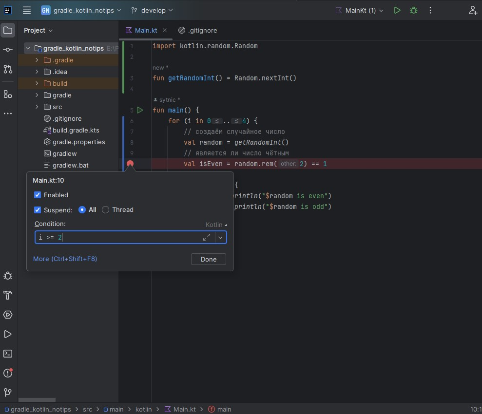
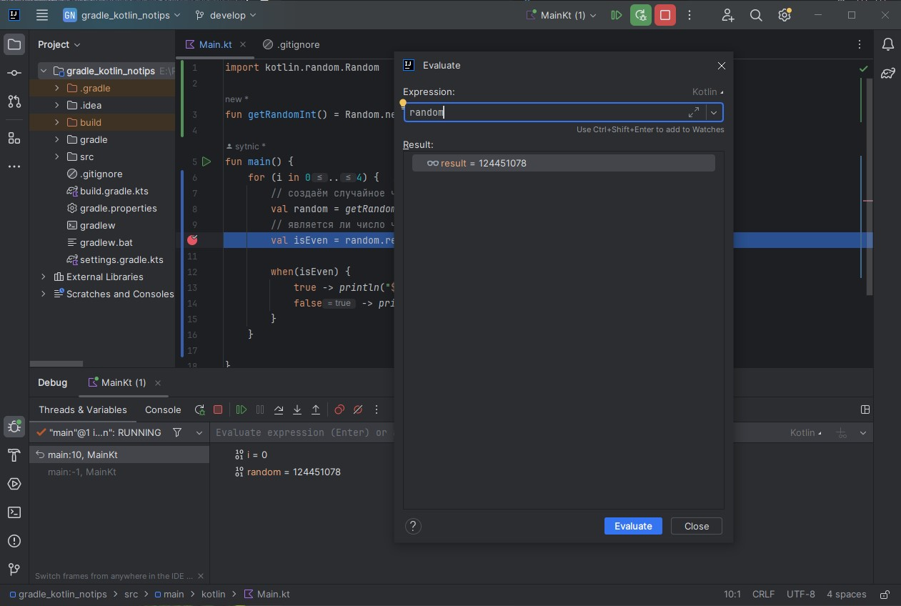
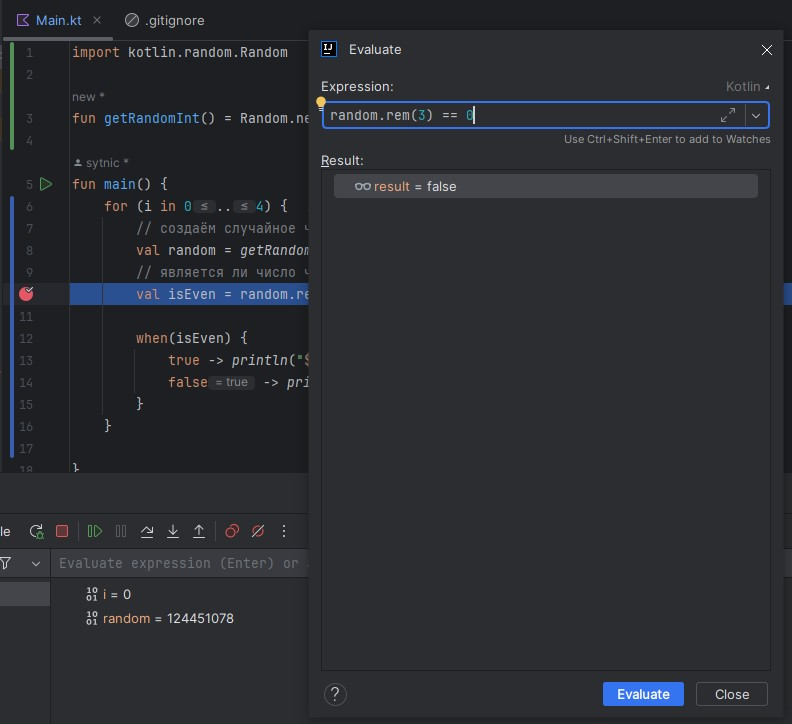
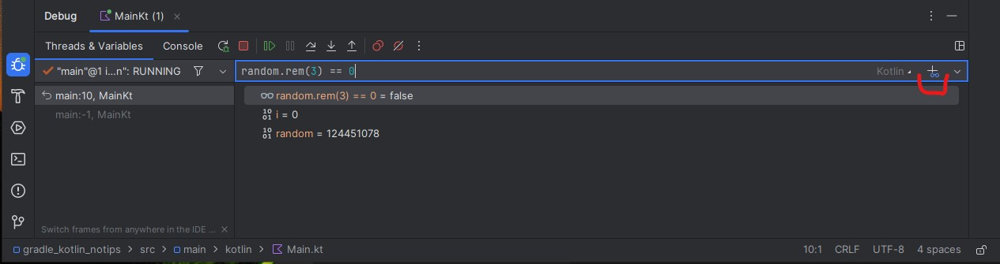

## 026-Setting breakpoints

```java
import kotlin.random.Random

fun main() {
    for (i in 0..4) {
        // создаём случайное число
        val random = Random.nextInt()
        // является ли число чётным
        val isEven = random.rem(2) == 1

        when(isEven) {
            true -> println("$random is even")
            false -> println("$random is odd")
        }
    }
}
// ошибки:
// even - чётный
/*
-846442313 is odd
313554350 is odd
1399260591 is even
2020199798 is odd
-1336003460 is odd
*/

```

## 027-Stepping through code

Пример с двумя точками останова



Кнопка Resume (похожа на Play) переводит к следующей точке останова.  

Кнопка Stop (красный квадрат) останавливает отладку. 

Кнопка `Step Over F8` предназначена для перехода к следующей строке, и, следовательно, для того, чтобы не ставить точки останова на каждой строке.  

Кнопки `Step Into F7` и `Step Out` предназначены для проваливания в функцию, которая на пути отладки, и выхода из неё.  

Условная точка останова. Срабатывает только при указанном условии.



## 028-Evaluate expressions and add watches

### Evaluate expressions 

Инструмент оценки выражений (Evaluate expressions tool) позволяет сделать попутные вычисления во время отладки без необходимости переделывать код.  
Выглядит как калькулятор (в трёх точках), запускается как "Evaluate expressions..." Alt+F8.

Пример вычисления (получения) значения переменной



Пример вычисления - делится ли перменная на 3 без остатка



### Watches

Часы (наблюдатели) добавляются в правом углу строки дебаггера. В эту же строку прописываются нужные условия.



Чтобы проверить, достигается ли нужное значение (вычисление), нажимаем Resume (похож на Play) и watch наблюдает за значением при каждом изменении.  

---

