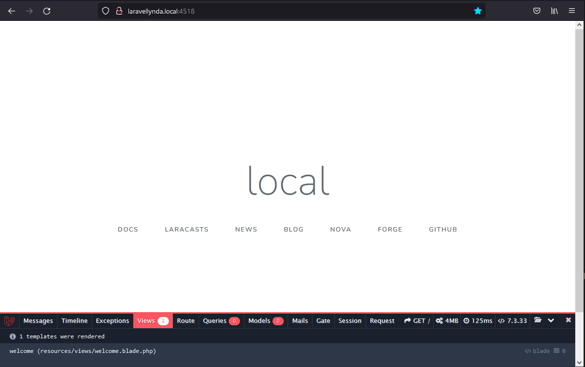

[//]: Закомментировано
[//]: 
[//]: 

http://laravellynda.local:4518/

Пример отображения значения APP_ENV из .env файла или config\app.php

What's going on here. How this code works.

1. Маршрут routes/web.php отвечает за загрузку главной страницы и вью welcome.blade.php .
2. В welcome.blade.php отрабатывает {{ App::environment() }} .

