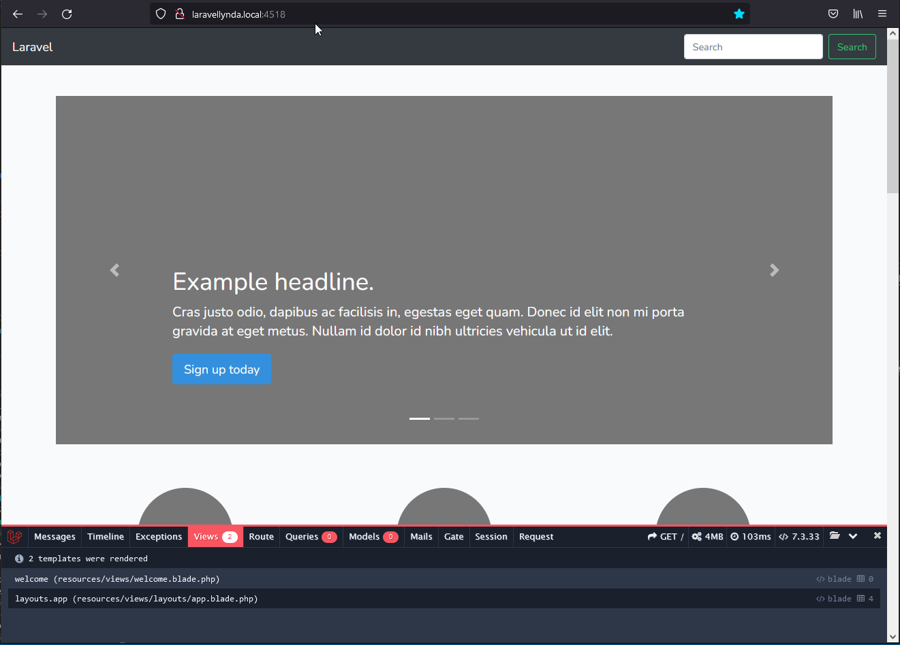

http://laravellynda.local:4518/

Загрузка главной страницы

What's going on here. How this code works.

1. Маршрут routes/web.php отправляет на главную страницу и загружает вью welcome.blade.php .
2. welcome.blade.php согласно @extends('layouts.app') отправляет на загрузку макета из пути resources\views\layouts\app.blade.php .
3. В app.blade.php строка @yield('content') заполняется данными @section('content')...@endsection из welcome.blade.php .

По факту загружается app.blade.php, в котором для строки @yield('content') передаётся содержание @section('content')...@endsection из welcome.blade.php .