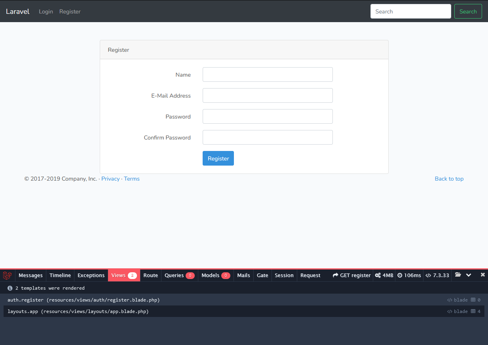

Команды, введённые после входа в linux (vagrant ssh)

1. Нужно настроить .env файл

    php artisan migrate

Будут созданы таблицы из миграций.

2.

    php artisan make:auth

Визуально в шапке появятся две ссылки:
- http://laravellynda.local:4518/login
- http://laravellynda.local:4518/register

В коде появится:
- файл app\Http\Controllers\HomeController.php
- группа файлов в \resources\views\auth
- файл resources\views\home.blade.php

Скорректируется routes\web.php

3. Эти группы файлов строят страницу совместно с app.blade.php.  
 app.blade.php является главным шаблоном, обрамляющим страницу.  
 В app.blade.php изначально встроена возможность ссылок Login, Register в шапке на основе php (if else). 

Посмотреть, какой получается вью Html + Php без блэйдов можно в storage\framework\views . 

