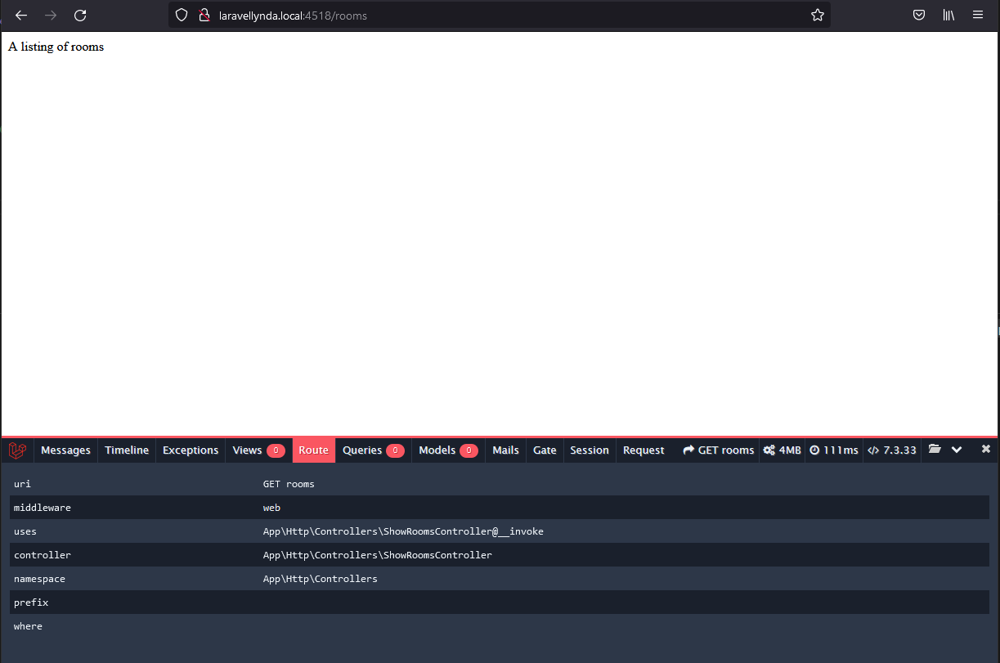

Создание простого контроллера c invokable:

    php artisan make:controller ShowRoomsController --invokable

1. Корректируется маршрут в routes/web.php

2. Корректируется контроллер  

Вставка строки  
return response('A listing of rooms', 200);  
в контроллер приводит к выводу этой строки на экран  
по пути /rooms

Отрабатывает магический метод __invoke в контроллере, несмотря на то, что в маршруте метод не указан вообще, только контроллер.

Вью не задействованы вообще. Работают только маршрут и контроллер.
