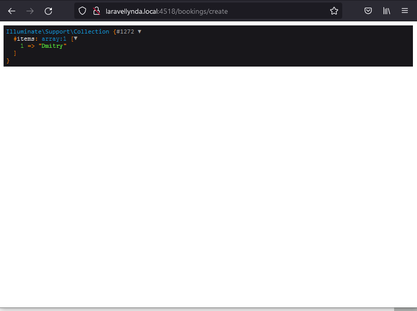
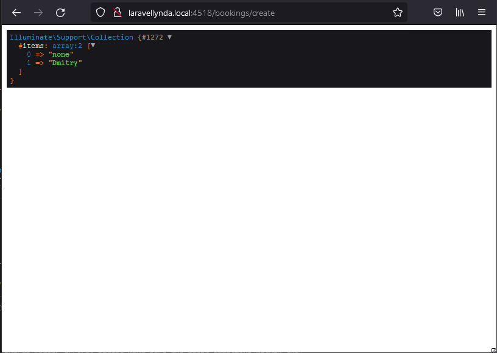

18.0

http://laravellynda.local:4518/bookings/create

1. Работает Get-запрос в адресной строке. Он же работает по кнопке "Add New Booking".
2. Маршрут web.php направляет на ресурсный BookingController
2. Отрабатывает одна строчка  
    $users = DB::table('users')->get()->pluck('name', 'id')->dd();  
из метода BookingController@create

18.1

http://laravellynda.local:4518/bookings/create

То же самое с добавлением одного дополнительного пустого элемента массива в начало коллекции:  

    $users = DB::table('users')->get()->pluck('name', 'id')->prepend('none')->dd();

