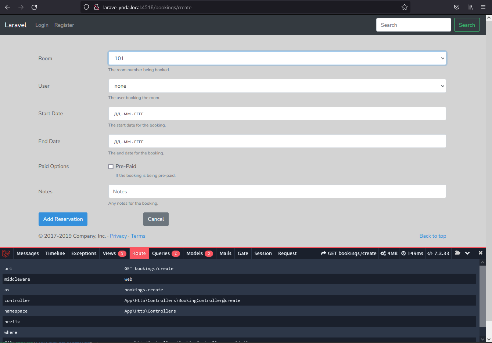
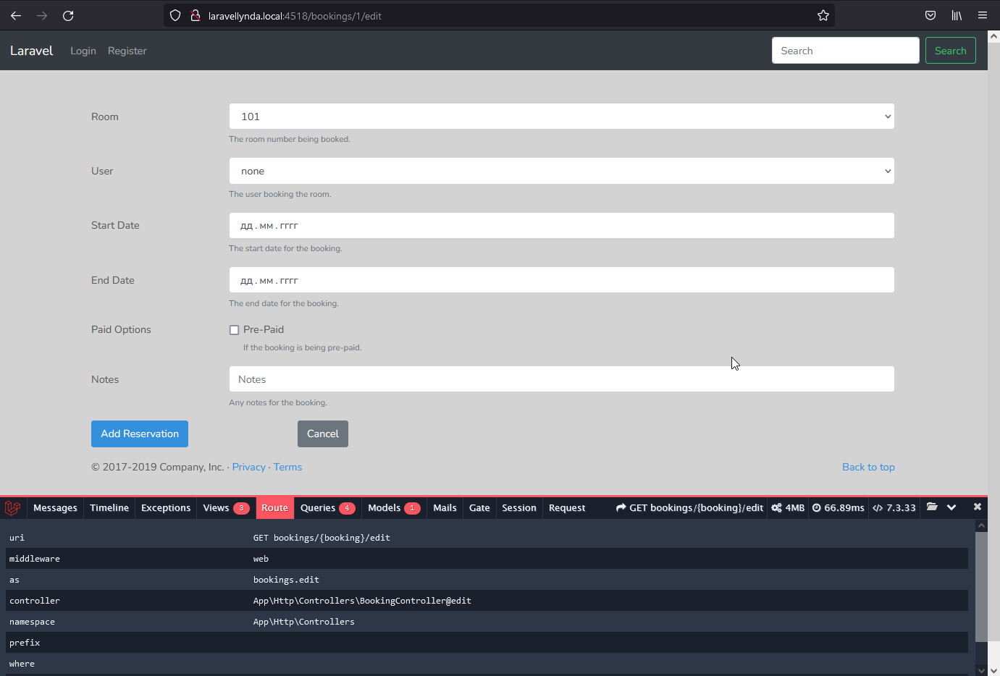
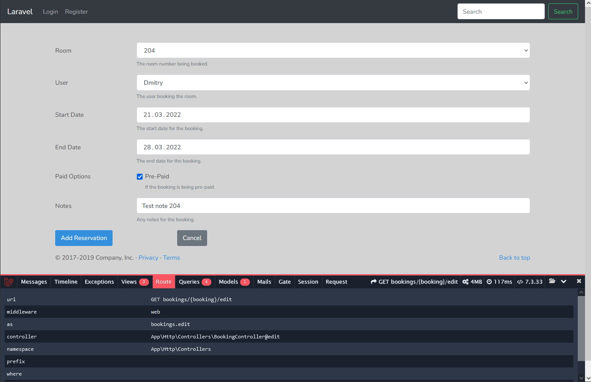

23.0  @include

http://laravellynda.local:4518/bookings/create

1) Этот url отрабатывает так же, как и раньше. Нововведением является то, что из вью bookings\create.blade.php вырезана часть и помещена в отдельный файл, которая теперь подключается одной строчкой во вью bookings\create.blade.php с помощью @include.

23.1

http://laravellynda.local:4518/bookings/1/edit

1) Страница редактирования /bookings/1/edit тоже отображается так же, как и раньше, но поля формы подключаются теперь через @include .  
При редактировании пока, однако, не учитывается параметр запроса, соответствующий конретному id.

23.2

http://laravellynda.local:4518/bookings/2/edit

Во вью resources\views\bookings\fields.blade.php, в его html код были введены дополнительные blade-директивы, которые (на базе конструкций if_else php-кода) отслеживают совпадение id, по которому совершился переход на данную страницу, с данными на странице и, таким образом, эти директивы выставляют дополнительный html-код "selected" и "checked" в форме.  

