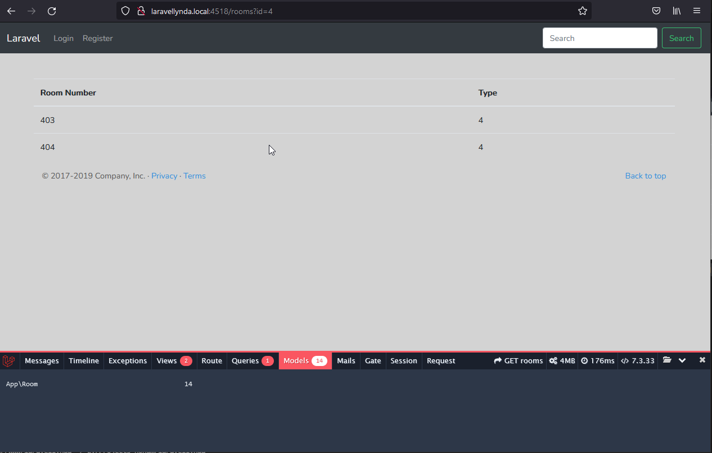

## 26. The_first_model

В папке с кодом:

    php artisan make:model --factory Room

Будут созданы фэктори и модель Room.

Работа с пустой моделью Room равнозначна работе с DB.   
Появилось заполнение у Model в дебагбаре, которое обозначает количество записей в БД.  
Отрабатывает пара строк в ShowRoomsController  

    use App\Room;
    ...
    $rooms = Room::get();

http://laravellynda.local:4518/rooms

http://laravellynda.local:4518/rooms?id=4
