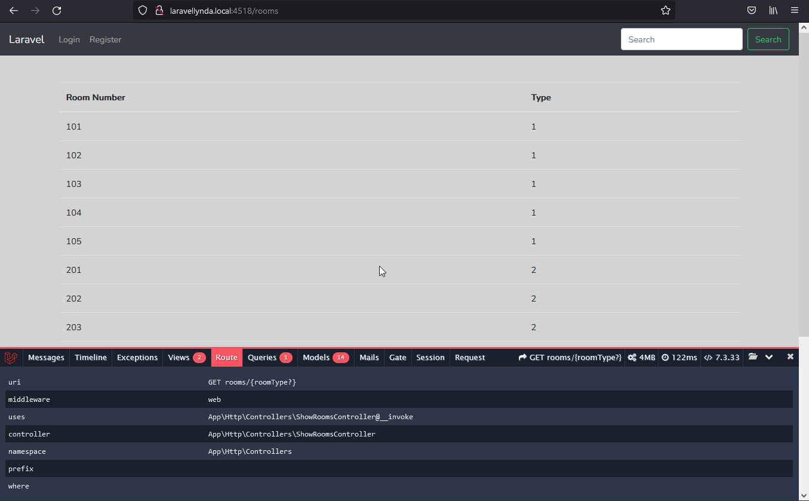
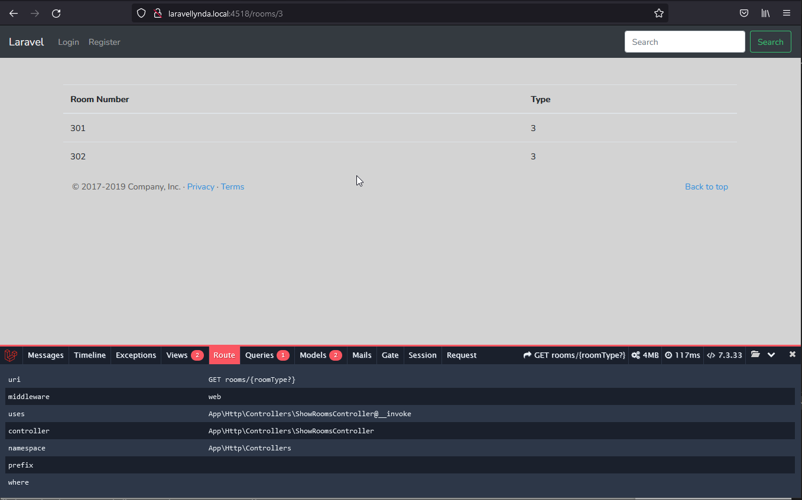

## 32. Scopes

В моделе Room используется функция с префиксом "scope"

    public function scopeByType($query, $roomTypeId = null) {
    ...
    $query->where('room_type_id', $roomTypeId);
    ...
    }

 и эта функция потом используется в контроллере ShowRoomsController без префикса scope.

    $rooms = Room::byType($roomType)->get();

Cкоупы (так называемые локальные) позволяют записывать повторяющиеся длинные конструкции where в запросах моделей в виде короткого метода, который потом можно применить в цепочке методов в Контроллере.

Таким образом, один из запросов where вынесен в модель Room из Контроллера, но работа приложения совершается, как и раньше, как и ожидается.

 

http://laravellynda.local:4518/rooms

    

http://laravellynda.local:4518/rooms/3

