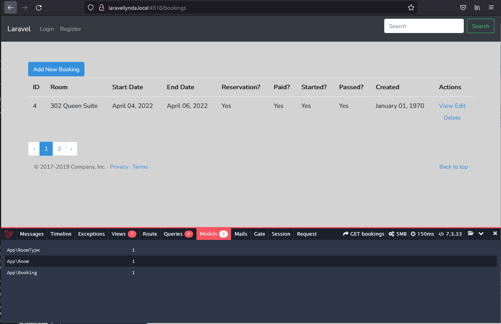
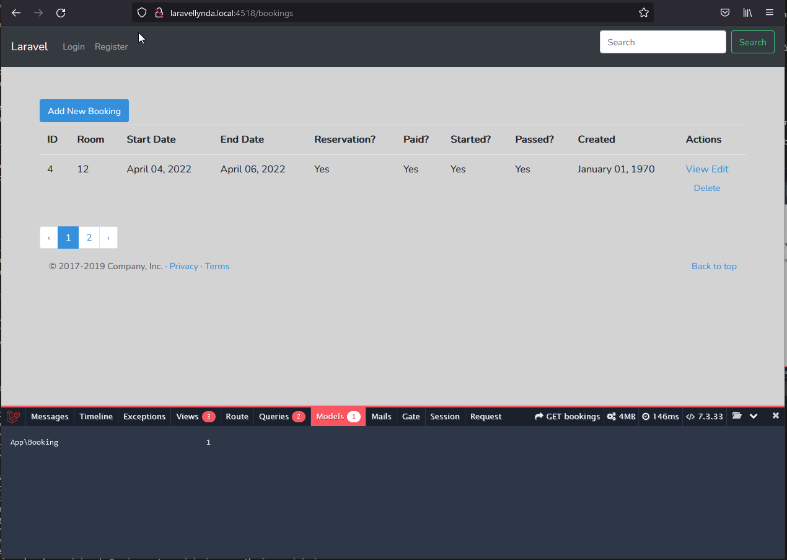

## 36. Lazy-loading_relationships
## 37. Eager_loading_relationships

http://www.itmathrepetitor.ru/laravel-5-otnosheniya-i-zhadnaya-zagruzka-v-eloquent/

https://laravel.ru/forum/viewtopic.php?id=2359

Жадная загрузка (eager loading) - загружаем все, что может понадобиться, ленивая загрузка (lazy loading) - загружаем только то, что требуется.

### Lazy-loading

Ленивая загрузка - это обращение к некоторым полям связанных и вложенных таблиц, причем даже без прописывания этого в контроллере, а только во вью.

Например, запись во вью  
{{ $booking->room->number }} {{ $booking->room->roomType->name }}  
означает последовательное обращение к таблицам  
bookings.room_id -> rooms.number и   
bookings.room_id -> rooms.roomTypeId -> room_types.name

Таким образом, в столбце Room отображается два значения из других таблиц (не bookings) ...

http://laravellynda.local:4518/bookings

... вместо цифры room_id из таблицы bookings:

http://laravellynda.local:4518/bookings

