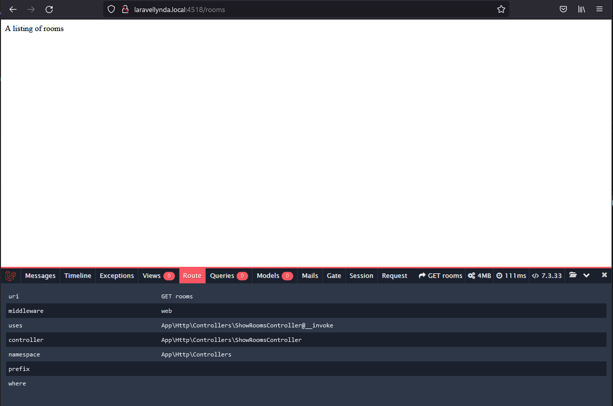

## Создание простого контроллера c invokable:

Создание контроллера

    php artisan make:controller ShowRoomsController --invokable

Создать маршрут в routes/web.php:  

    Route::get('/rooms', 'ShowRoomsController');

Создать строку в методе __invoke() контроллера:  

    return response('A listing of rooms', 200);

Вставка этой строки в контроллер приводит к выводу этой строки на экран по пути  

[/rooms]()

Отрабатывает магический метод __invoke в контроллере, несмотря на то, что в маршруте метод не указан вообще, только контроллер.

Вью не задействованы вообще. Работают только маршрут и контроллер.
