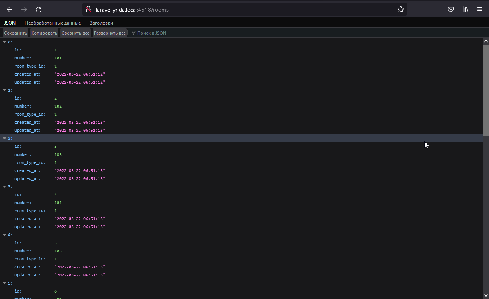
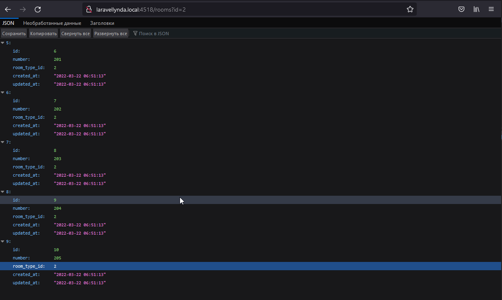

## 12. Вывести на экран список комант из БД

12.0

http://laravellynda.local:4518/rooms  

1. Работает routes/web.php и отправляет в контроллер ShowRoomsController
2. ShowRoomsController в методе __invoke выводит на экран все комнаты из БД в формате JSON

12.1

http://laravellynda.local:4518/rooms?id=2

Теперь, благодаря корректировке контроллера, на экран выводятся только те записи комнат, у которых room_type_id равен числу, указанному в параметре запроса.

