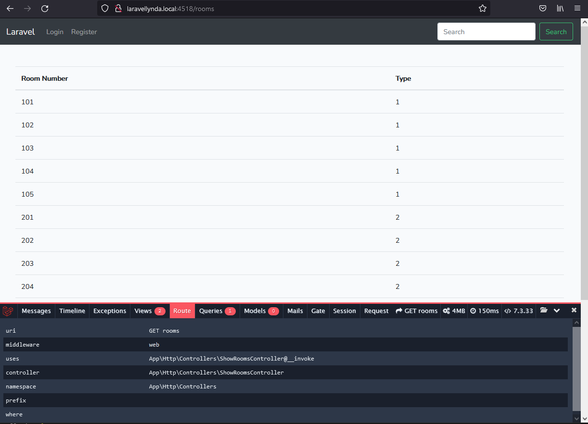
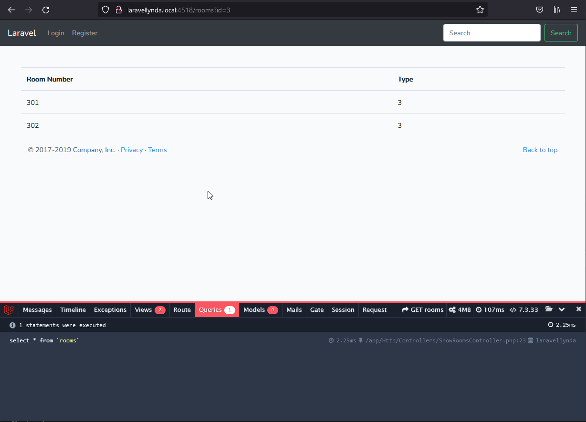

## 13. First view

13.0

http://laravellynda.local:4518/rooms

1. Работает routes/web.php и направляет по этому url в контроллер, метод в web.php не указан, т.к. автоматически запускается магический метод __invoke.
2. Контроллер app\Http\Controllers\ShowRoomsController.php  
работает по своей логике. В нём создаётся и обрабатывается переменная $rooms. Затем вызвывается вью, туда передаётся эта переменная под названием 'rooms'.

http://laravellynda.local:4518/rooms?id=3

1. Отрабатывает точно так же, но дополнительно $rooms перезаписывается в контроллере, отсеивая ненужные данные, когда задан параметр запроса в адресной строке, .

