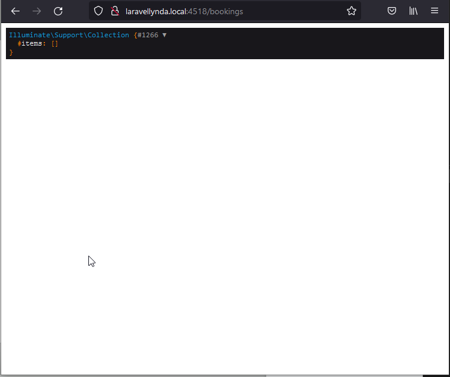

## 15. Resource_controller_actions

Создаётся контроллер и модель:

    php artisan make:controller BookingController --resource --model=Booking

http://laravellynda.local:4518/bookings

1. Маршрут web.php отправляет по этому url на ресурсный контроллер BookingController, так как в нем как таковом заложена отработка по гет-запросу get('/bookings', 'BookingController@index') и, соответсвенно, заложен вызов метода index.

2. В методе index отрабатыает одна созданная строчка  

        \DB::table('bookings')->get()->dd();  

результат которой и выводится на экран.

