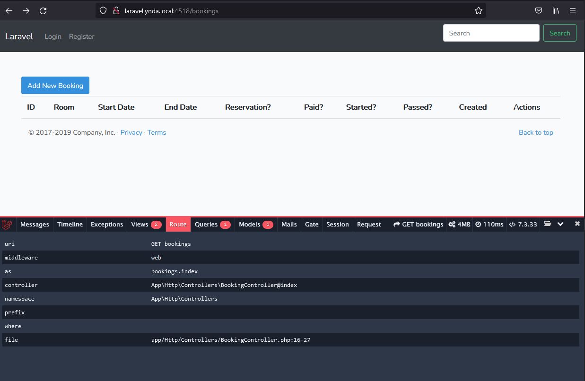

## 17. Index_view



http://laravellynda.local:4518/bookings

1. routes/web.php строкой 
```
Route::resource('bookings', 'BookingController');  
```
 отправляет в контроллер как в ресурс.

2. Ресурс означает, что в его составе отрабатывает  
```
Route::get('/bookings', 'BookingController@index');
```
т.е. url '/bookings' и метод ..@index .

3. Метод BookingController@index создаёт и обрабатывает переменную $bookings, собирая в нее все данные из соответствующей таблицы БД, и передаёт её во вью, вызывая вью 
>resources\views\bookings\index.blade.php


4. >views\bookings\index.blade.php  

составлена из основного шаблона 
>resources\views\layouts\app.blade.php  

и двух новых секций, предусмотренных в составе layouts\app.blade.php: 
> @section('buttons') и @section('content') .

Кнопка "Add New Booking" пока не работает, хотя уже отправляет на нужный пустой url.