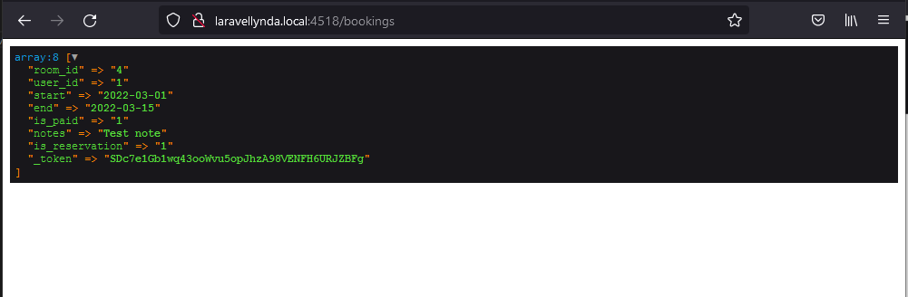
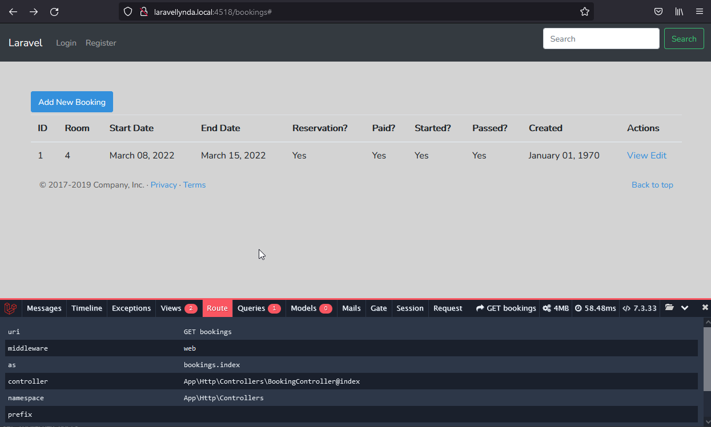

## 20. Store_an_action

20.1

Итак, на этой странице http://laravellynda.local:4518/bookings/create  
 отрисовывается форма html, подготовленная к POST-отправке.


1) После заполнения формы по нажатию на кнопку Add Reservation  
 срабатывает submit из формы, который вызывает, согласно форме, маршрут "bookings.store" и метод POST:  

```   
    <form action="{{ route('bookings.store') }}" method="POST">
```

2) Этот маршрут настроен на вызов url "/bookings" и метода BookingController@store .

3) В методе отрабатывает только одна строчка с dd()  
```
    dd($request->all());
```
Все данные формы с параметрами name="" (как ключами массива) отправляются с этим запросом.  
_token берётся из директивы "@csrf" из формы.

http://laravellynda.local:4518/bookings



---

20.2

1) После подготовки контроллера BookingController@store  
и отправки данных по кнопке "Add Reservation"     
2) согласно BookingController@store, где ловятся значения из формы, заполняются таблицы и происходит редирект на "/bookings",  
3) на которой отображаются данные из таблицы "bookings" согласно BookingController@index. Тут отрабатывает вью resources\views\bookings\index.blade.php .

http://laravellynda.local:4518/bookings



Время под столбец "created_at" нигде не создавалось, поэтому в таблице оно сохраняется как "null" и отображается как "January 01, 1970" .


