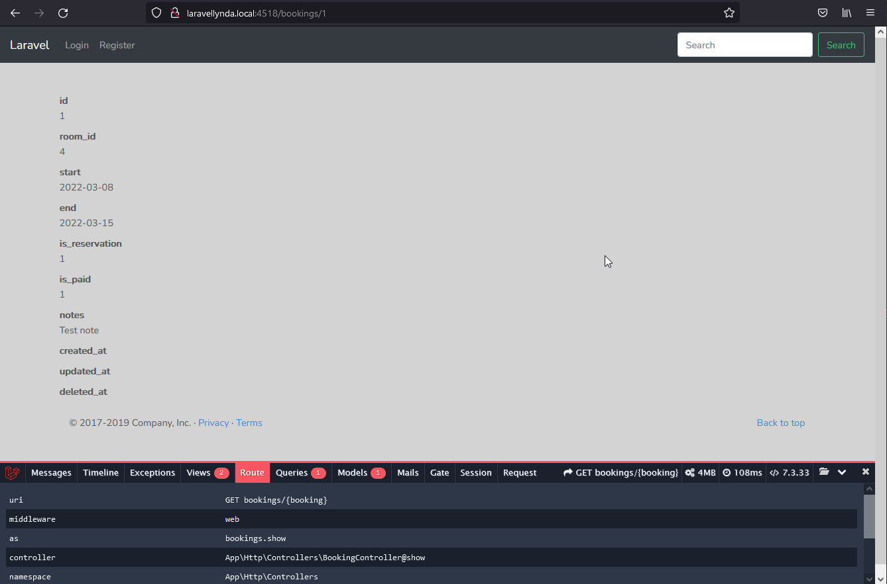
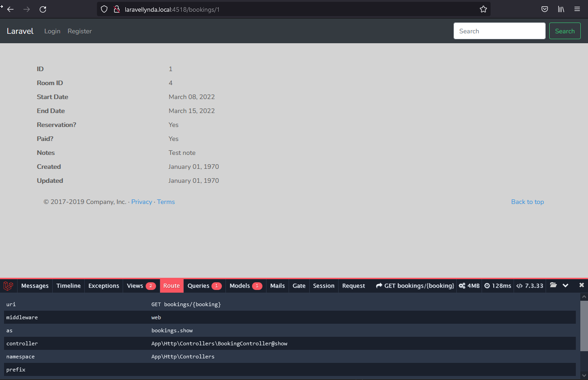

21.1

http://laravellynda.local:4518/bookings/1

Url отрабатывает также по ссылке "View". Url вызывается согласно маршруту bookings.show, к-рому соответсвует uri "bookings/{booking}" и action "BookingController@show" .  
В @show отрабатывает одна строчка:

    dd($booking);  

21.2

http://laravellynda.local:4518/bookings/1

1) По ссылке View происходит переход на bookings/1 согласно маршруту
2) Согласно маршруту работает BookingController@show
3) В BookingController@show работает только одна строчка, она вызывает view('bookings.show', и передает туда объект $booking под именем booking:  

       return view('bookings.show', ['booking' => $booking]);

4) Во вью через foreach обрабатывается массив $booking->getAttributes(). Благодаря перебору свойств массива будут получены все поля и их значения из БД по заданной записи (id == 1) и выведены на экран.

21.3

http://laravellynda.local:4518/bookings/1

Происходит то же самое с другим html (view), в котором (без цикла) идёт прямое обращение к свойствам объекта $booking, переданного во вью через контроллер.

