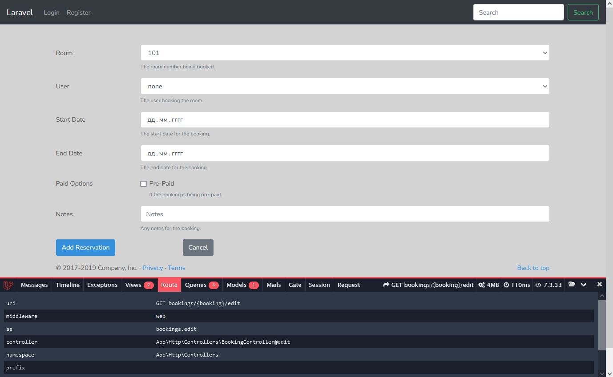

22

http://laravellynda.local:4518/bookings/2/edit

1) На индексной странице /bookings есть настроенная ссылка Edit. Ссылка настроена на вызов BookingController@edit .
2) Согласно маршрутам (php artisan route:list) этот метод связан с url'ом "bookings/{booking}/edit" и методом GET.
Таким образом, вызывается url, например, "/bookings/2/edit" и отрабатвает action BookingController@edit .
3) В action @edit вызывается вью resources\views\bookings\edit.blade.php и туда передаётся множество переменных, содержание которых собирается тут же через обращение к базе данных.  
Вью пока не настроено, поэтому пока не отрисовывается нужная информация. Совершается только переход на этот неподготовленный вью.

 