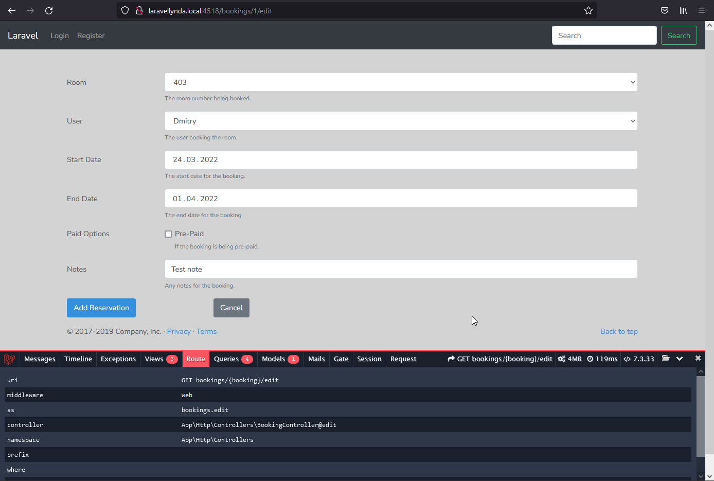
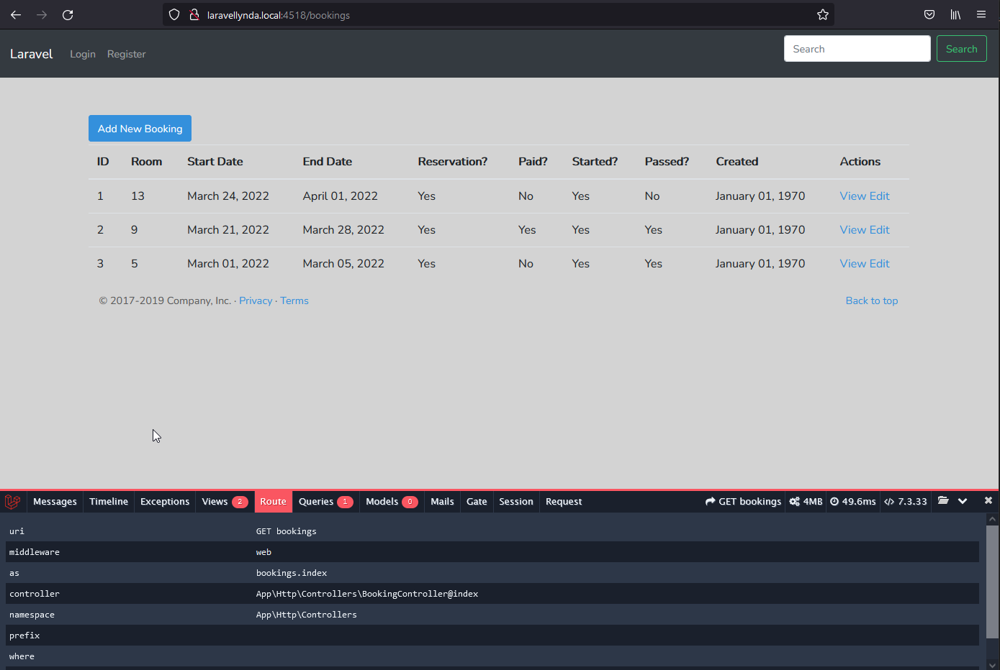

24  Update



http://laravellynda.local:4518/bookings/1/edit



http://laravellynda.local:4518/bookings

## Как происходит Update

1. Кнопка "Add Reservation" во вью `\bookings\edit.blade.php` отправляет всю форму этой страницы (submit) согласно action формы:  
```
    <form action="{{ route('bookings.update', ['booking' => $booking]) }}" method="POST">
        @method('PUT')
```
2. Маршрут update  
 (согласно `php artisan route:list` или можно `php artisan route:list > routes.txt`)  
  отправляет на  
    Url - `bookings/{booking} ` 
   и Action - `App\Http\Controllers\BookingController@update`.
3.  Отрабатывает @update,  
выполняет работу по сохранению данных в БД (update) в две таблицы,  
и совершает сразу же редирект на `BookingController@index`, который отображет главную страницу /bookings со списком всех записей из БД.


    


