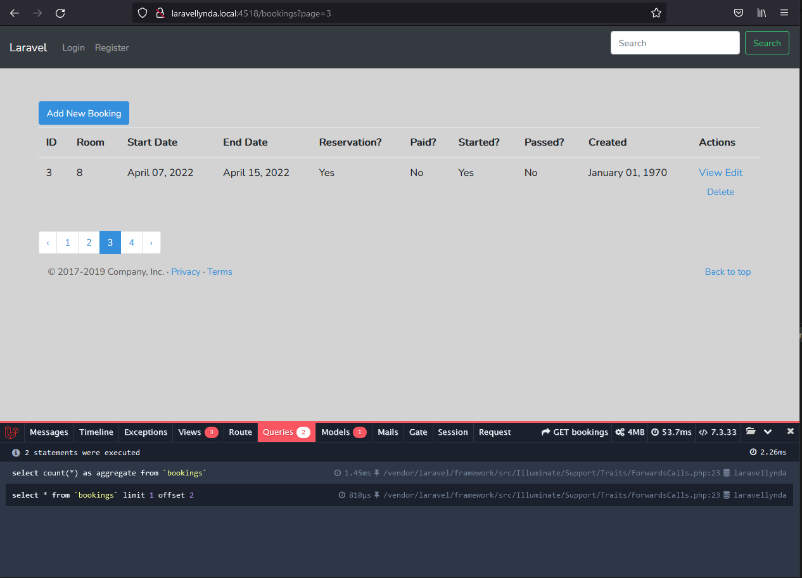

## 27. Pagination



http://laravellynda.local:4518/bookings?page=3

Пагинация продумана и выполняется самостоятельно с помощью добавления следующих моментов:  

1. 

В методе `BookingController@index` используется строчка пагинации

    $bookings = Booking::paginate(1);

вместо строчки, получающей все записи из БД

    $bookings = DB::table('bookings')->get();

2.

Добавление ссылок пагинации во вью `bookings\index.blade.php`:

    {{ $bookings->links() }}

3. Помимо этого может понадобиться указать в  
   `app\Providers\AppServiceProvider.php`
```
   use Illuminate\Pagination\Paginator;

    public function boot()
    {
        Paginator::useBootstrap();
    }
```
В качестве стилей должен применяться Bootstrap в этом случае.


