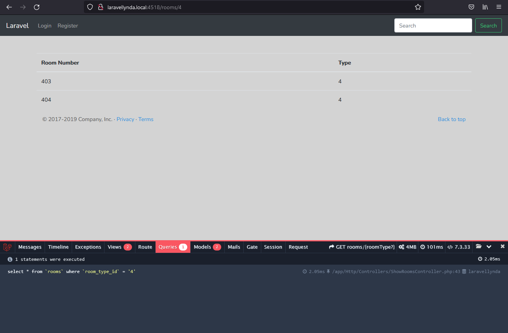
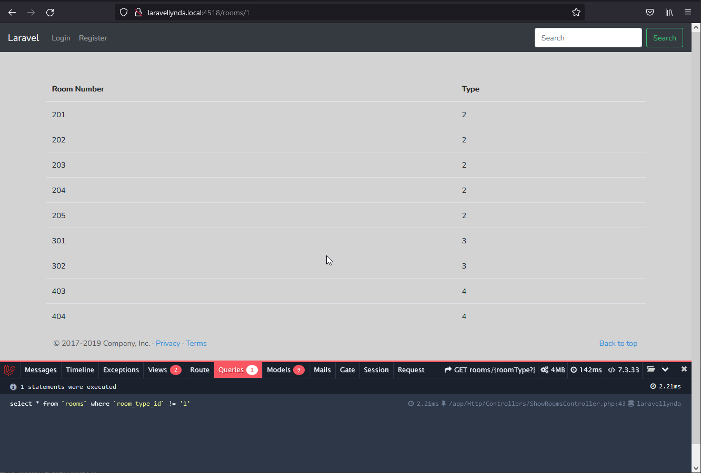

## 28. Finding

Благодаря дополнению необязательного параметра в маршрут `routes\web.php`  
и изменению `ShowRoomsController@__invoke` c добавлением запроса `Room::where`  
срабатывает возможность фильтрации данных по параметру после слэша в адресной строке.

http://laravellynda.local:4518/rooms/4

Также есть возможность указывать в запросе `Room::where` значения "не равно" ("больше, меньше").

    $rooms = Room::where('room_type_id', "!=", $roomType)->get();

http://laravellynda.local:4518/rooms/1
