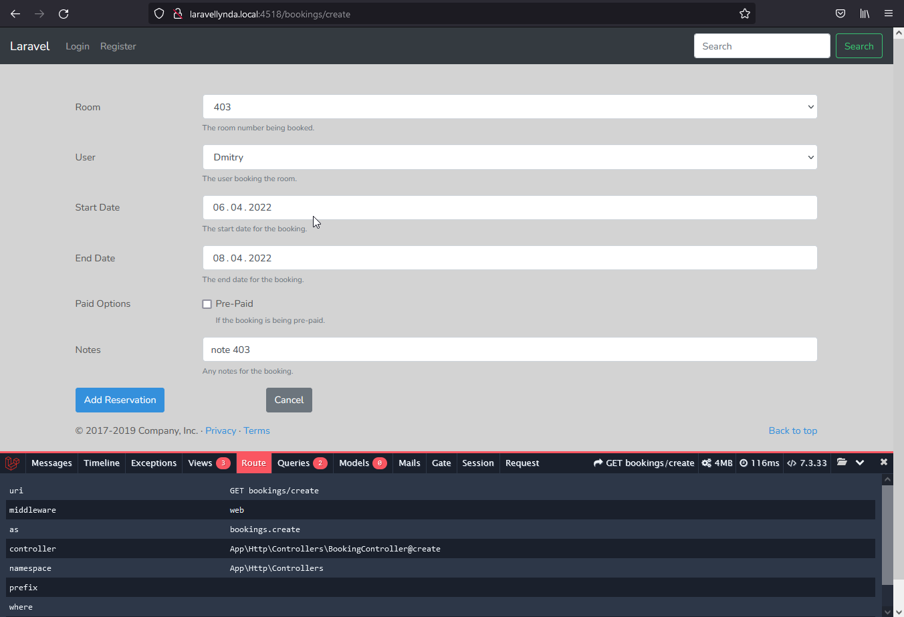
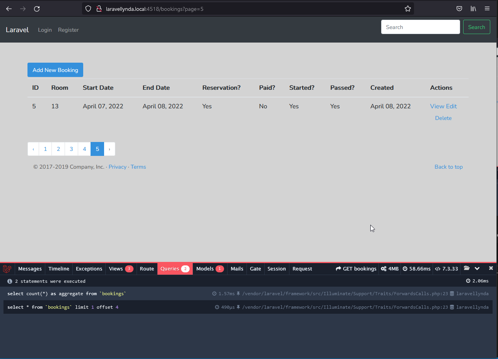

## 29. Saving

Кнопка Add Reservation (сохранение данных из формы в БД, метод @store) теперь работает на базе Eloquent при содействии модели Booking вместо DB:

    $booking = Booking::create($request->input());

http://laravellynda.local:4518/bookings/create

При этом заработало автоматическое заполнение полей created_at, updated_at.

http://laravellynda.local:4518/bookings?page=5