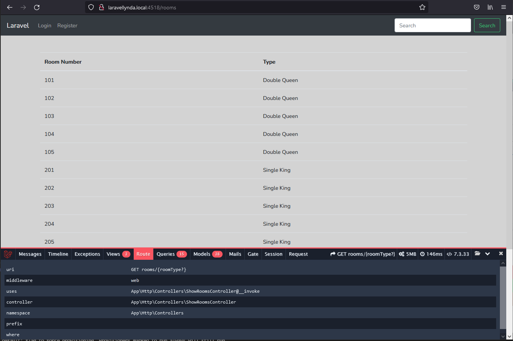

## 34. One-to-many_relationships

Model

```php
    class RoomType extends Model {
        public function rooms() {
            return $this->hasMany('App\Room','id','room_type_id');
        }
    }
```

View

    {{-- обращение к полю name другой таблицы room_types на основе отношений Eloquent --}}
    <td>{{ $room->roomType->name }}</td>

В одном и том же вью, благодаря отношениям Eloquent, воспроизводящим отношения между таблицами, выводятся значения из таблицы room и, одновременно, соответствующие им названия Type (name) из другой таблицы room_types.

 

http://laravellynda.local:4518/rooms
