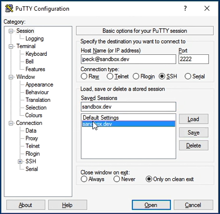
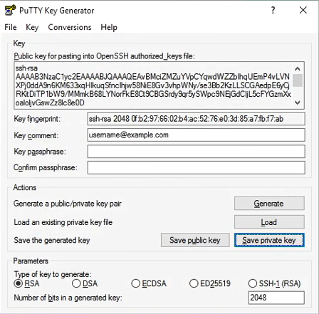

## 17. Talk to yourself with local networking

Прописывается значение для 127.0.0.1 в hosts

Windows

    %SystemRoot%\system32\drivers\etc\hosts

Mac/ Liinux  

    /etc/hosts

Значение. Здесь используется [Tab] вместо пробелов.

    127.0.0.1    sandbox.dev

## 18. Logging in using Secure Shell

## 19. Using SSH on a Mac

Вход на сервер с терминала:  

    ssh -p 2222 jpeck@sandbox.dev

> Далее опционально:

> Настройка закрытого ключа, чтобы пароль не требовался

Выход

    logout    

Настройка открытого и закрытого ключа.  

    ssh-keygen -t rsa -C "myemail@example.com"  

Будет предложен файл по умолчанию для сохранения данных

    Enter

Будет предложено придумать кодовую фразу. Для локалдьной разработки оставить пустым.  

    Enter

Ключи созданы.  
Необходимо добавить открытый ключ на сервер разработки (в место хранения открытых ключей).  

    ssh -p2222 jpeck@sandbox.dev mkdir -p .ssh

, где  
-p - флаг для создания внутренних каталогов при необходимости  
.ssh - имя создаваемого каталога  

Содержимое открытого ключа:  

    cat ~/.ssh/id_rsa.pub

Выполнение команды удаленно с использованием контекста публичного ключа (создание приватного ключа на сервере):  

    cat ~/.ssh/id_rsa.pub | ssh -p2222 jpeck@sandbox.dev 'cat >> .ssh/authorized_keys'

Теперь можно заходить на сервер без использования пароля:

    ssh -p2222 jpeck@sandbox.dev

> Создание сокращения для порта для следующих входов

    logout

    nano ~/.ssh/config  

В файл вводится информация, которая будет использоваться для следующих входов:  

```
Host sandbox.dev
    Port 2222
    User jpeck
```

Сохранить и выйти в Nano:

    ctrl + x
    y
    Enter

Теперь входить можно так:  

    ssh sandbox.dev

## 20. Using SSH on Windows

Подключение:  



Далее достаточно ввести пароль от сервера. 

Можно также подключаться так, если в hosts не прописывалось значение для 127.0.0.1:  

    127.0.0.1
    # или
    dmitry@127.0.0.1

> Далее опционально:

> Создание закрытого ключа, чтобы не требовался пароль

- Запустить PuTTYGen

- Нажать Generate, чтобы сгенерировать публичный и приватный ключи. Нужно будет поводить мышкой в пустой области, чтобы программа сгенерировала некоторую случайность.   

- Следует заполнить

  - Key Comment
  - Key passphrase (как дополнительный пароль, оставить пустым)

- Нажать Save private key



- Появится окно сохранения файла. Сохранить, например как username@example.ppk  

- Далее нужно скопировать публичный ключ на сервер. Копируем публичный ключ из окна программы PuTTYGen и переключаемся на терминал.  

- В терминале:  

  - Создать папку для хранения ключа  

        mkdir.ssh

  - Добавить содержимое публичного ключа  

        echo "ssh-rsa вставить сюда публичный ключ, нажав правую кнопку мыши" >> .ssh/authorized_keys

    Так будет заполнен файл авторизованных ключей.  
    Готово.

> Проверка входа без пароля

    logout

Чтобы сделать закрытый ключ доступным для PuTTY, щелкнуть правой кнопкой по сохранённому ключу username@example.ppk и выбрать "Load into Pageant"      

Посмотреть добавленный ключ можно щелкнув правой кнопкой по Pageant в трее и выбрав "View Keys"

Можно закрыть PuTTYGen.  

Перезапустить PuTTY и подключиться как обычно. Пароль от сервера спрашиваться не будет, сразу происходит подключение к серверу.  

## 21. Navigating a command-line shell

https://manpages.ubuntu.com/

Условные обозначения в обозначении сервера в терминале  

    dmitry@sandboxdev:~$

    ~ - домашний каталог пользователя /home/user
    $ - обычный пользователь системы  
    # - root пользователь

> Известные команды:  

    pwd
    ls
    ls -a   - показывает и скрытые файлы
    
    ls -la
        в результате буждет список, где
    .    - текущий каталог
    ..   - родительский каталог  

просмотр каталога, не заходя в него:

    ls -la .ssh

-

    cd
    mkdir   - создание каталога

Каталог с логами

    /var/log 

## 22. Reading and searching files

Открыть файл

    cat myfile

Команды, чтобы открыть начало или конец файла.  

    head myfile
    tail myfile

Команда less предназначена для просматривания/прокрутки файла. Особенности кнопок клавиатуры при этом:  

    less myfile
    [return] - go forward one line
    [space] or f - scroll one page
    b - go backward one page
    q - quit

Поиск файлов

    find .  # поиск всех файлов в текущей папке и во вложенных
    
Поиск файлов по шаблону

    grep # чувствителен к регистру

Поиск в текущей папке всех файлов со словом "error" в названии 

    find . | grep error

Поиск в файле auth.log попыток авторизации пользователя независимо от регистра имени (-i)

    grep -i jpeck auth.log

## 23. Administration commands with sudo

    sudo
    sudo cat /etc/shadow

    sudo shutdown -h now
    # -h выключает виртуальную машину

---


