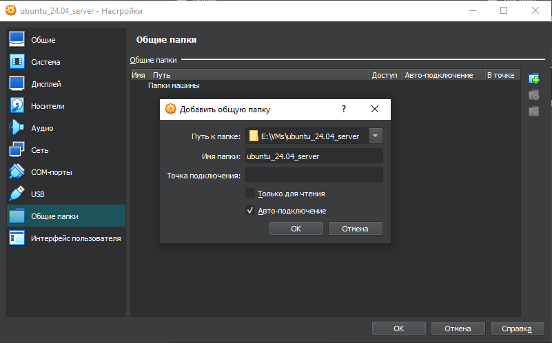
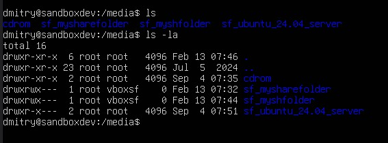
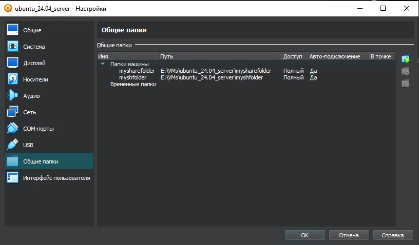

## 24. Upgrading and installing packages

Обновить список доступных пакетов  

    sudo apt-get update

Обновить установленное программное обеспечение  

    sudo apt-get upgrade

или с ответами по умолчанию "да" "yes" по всем вопросам

    sudo apt-get upgrade -y

Шаблон для установок:  

    apt-get install [PACKAGE] [PACKAGE]...  

Установка программ:  

    sudo apt-get install build-essential virtualbox-dkms nano zip unzip curl man-db acpid git module-assistant

, где:   

- build-essential - коллекция инструментов для компиляции програмного обеспечения.  
- virtualbox-dkms - модуль динамической поддержки ядра  
- module-assistant - управление пакетами ядра
- acpid - Advanced Configuration and Power Interface daemon

Перезагрузка сервера  

    sudo reboot

## 25. Installing VirtualBox Guest Additions

Первоначально нужно смонтировать диск с дополнениями в вирутальный cd-rom. Это делается из Виртуальной машины. Путь в Windows: 

C:\Program Files\Oracle\VirtualBox   

Далее работа в терминале.  

Поиск cd-rom'a

    ls -la /dev | grep cdrom

Просмотр каталога для файлов смонтированного диска из cd-rom'a. Он сейчас пуст.

    ls -la /media/cdrom

Создать папку при необходимости

    sudo mkdir /media/cdrom

Монтирование cd-roma в папку

    sudo mount /dev/cdrom  /media/cdrom

Предупреждение говорит о том, что диск смонтирован только для чтения.  

    mount: /media/cdrom: WARNING: source write-protected, mounted read-only.

Просмотр, какие файлы смонтировались. Файл установщика - VBoxLinuxAdditions.run  

    ls -la /media/cdrom

Запуск файла установщика из папки с указанием, что у нас нет графического интерфейса (--nox11)

    sudo sh /media/cdrom/VBoxLinuxAdditions.run --nox11

Перезагрузка

    sudo reboot

Проверка работы установленных дополнений  

    lsmod | grep vbox

> Надо найти запись vboxsf - модуль для share folders.  

> Также должна быть создана папка sf_sandbox для расшареных папок в /media. 

    ls -la /media

У меня создалась 

> sf_ubuntu_24.04_server   

согласно указанному имени в Общие папки.  

Эту папку можно поменять в настройках Общие папки, но, при замене папок, доступ к предыдущей расшаренной папке может пропасть из-за несоответствия группе - root vboxsf.  
Также, можно добавить несколько расшаренных папок.

 

Далее нужно будет предоставить права к расшареной папке.  

## 26. Configuring group permissions for access

Посмотреть права. В списке следуют сначала пользователь, потом - группа.

    ls -la /media
    ->
    total 16
    drwxr-xr-x  4 root root   4096 Sep  4 07:51 .
    drwxr-xr-x 23 root root   4096 Jul  5 08:38 ..
    drwxr-xr-x  2 root root   4096 Sep  4 07:35 cdrom
    drwxrwx---  1 root vboxsf 4096 Sep 11 07:58 sf_ubuntu_24.04_server

Попытка войти в папку будет отклонена по правам

    cd /media/sf_ubuntu_24.04_server/
    ->
    -bash: cd: /media/sf_ubuntu_24.04_server/: Permission denied

Показать мои группы

    id

Узнать, кто входит в группу vboxsf

    getent group vboxsf
    ->
    vboxsf:x:989:

> vboxsf:x:989:   
означает

    группа:пароль(x или пусто):идентификатор группы:список пользователей(сейчас пуст)

Добавить пользователя dmitry в группу vboxsf, где -a append (добавить), -G group (группа)

    sudo usermod -a -G vboxsf dmitry

Чтобы изменение вступило в силу, нужно выйти из системы и войти заново.  

    logout

Проверка после входа

    getent group vboxsf
    cd /media/sf_ubuntu_24.04_server/

> Доступ к папке для Apache

Проверка группы Apache

    id www-data
    ->
    uid=33(www-data) gid=33(www-data) groups=33(www-data)

На основе записи groups, группа - www-data.  

Предоставление к папке доступа для Apache, путём добавления пользователя Apache в группу vboxsf  

    sudo usermod -a -G vboxsf www-data

Проверка

    getent group vboxsf
    ->
    vboxsf:x:989:dmitry,www-data

Далее необходимо сконфигурировать Apache на работу с этой папкой.  

## 27. Configuring Apache HTTP Server

Конфигурация Linux хранится в /etc .  

    cd /etc

Показать список папок по одной в строке.

    ls -1

Показать список папок по фильтру Apache

    ls -1 | grep apache
    ->
    apache2

Возможно, что Apache не был установлен во время установки Ubuntu (глава 16). Тогда его нужно установить вручную.

https://ubuntu.com/server/docs/how-to-install-apache2

    sudo apt install apache2

Сайт Апаче по умолчанию должен открываться на машине хоста по адресу:  

    http://127.0.0.1:8080/

Приветственный файл Апачи расположен по адресу   
> /var/www/html/index.html

Однако он, вероятно, не будет работать после следующих перенастроек, т.к. в следующем параграфе в sites-enabled ссылка будет изменена с 000-deafault.conf на vboxsf.conf

Список папок в /apache/

    cd apache2
    ls -la

Основная конфигурация Apache хранится в файле apache2.conf. Распределённая конфигурация хранится в папках sites-available и sites-enabled .  

Просмотр

    ls -la sites-available
    ls -la sites-enabled

`sites-enabled` содержит ссылку на файл `000-default.conf` в папке `sites-available` .  

Файлы .conf - это настройки сайтов. Из папки enabled ссылки включают (запускают) сайты и ссылаются на настройки сайтов, расположенные в папке available. Т.е. в sites-available может быть расположено несколько файлов конфигурации, а в sites-enabled будут размещены именно те ссылки на конфигурационные файлы, которые делают сайты рабочими. 

Сами сайты расположены в папке 
> /var/www/html  

Создать файл конфигурации и вставить в него информацию из файла упражнений.  

    sudoedit sites-available/vboxsf.conf

    ctrl+X
    Y
    Enter

> Настроить порты Apache

    cd /etc/apache2
    sudoedit ports.conf

Дописать

    // было
    Listen 80    
    
    // стало
    Listen 80
    Listen 8080

    ctrl+X
    Y
    Enter

Далее нужно заставить Apache начать использовать эти новые конфигурации.  

## 28. Managing Apache sites and modules

Будут применены две команды. Они, по сути, создают символические ссылки для включения (отключения) сайтов в enabled папке, ссылающиеся на available папку.

> a2ensite  - Apache2 enables the site  
> a2dissite - Apache2 disables the site

Эти команды фактически создают и удаляют ссылки в директории sites-enabled, которые ссылаются на папку sites-available , таким образом включая и отключая сайты.

В папке etc/apache2/sites-available лежат файлы конфигураций под сайты: 000-default.conf, vboxsf.conf. В sites-enabled только предстоит создать ссылки, по умолчанию там одна ссылка 000-default.conf .

**Создание ссылки на необходимый сайт**  
Делается из папки etc/apache2. Будет включена конфигурация сайта vboxsf, т.е. создана ссылка из sites-enabled на файл ../sites-available/vboxsf.conf

    sudo a2ensite vboxsf 

**Отключение сайта (ссылки на сайт) по умолчанию**  
Будет отключена конфигурация сайта 000-default (удалена ссылка на 000-default.conf из папки sites-enabled)  

    sudo a2dissite 000-default

 * * *
Далее будут применены две команды, включающие и отключающие некоторые модули  

> a2enmode - Apache2 enables the module  
> a2dismode - Apache2 disables the module

**Включение некоторых модулей**

    sudo a2enmod rewrite vhost_alias

Требуется перезагрузка. Перезагрузка совершается командой service (службы), она имеет некоторые параметры (action)

- start
- stop
- restart
- reload - поддерживается не всеми службами

Таким образом, вид команды такой

> service [name][action]

**Перезагрузка Apache**

    sudo service apache2 restart

Терминал рекомендует другую команду:

>   systemctl reload apache2

В браузере можно проверить статус Апачи:

    127.0.0.1:8080/server-status

Далее нужно будет настроить PHP.

## 29. Configuring PHP for development

PHP установил вручную как самую последнюю версию. Через php/ondrej, как обычно, ничего не получилось.

В файл `/etc/apache2/sites-available/vboxsf.conf`, на который и только который идёт ссылка из `sites-enabled`, добавил наверх строку `DocumentRoot /media/sf_mysharefolder/`

    <VirtualHost *:80 *:8080>
    ServerName sandboxdev
    ServerAlias *.dev

    DocumentRoot /media/sf_mysharefolder/

Возможно, можно было внизу поменять следующую строку, указывая свою реальную папку, но я не менял:

    VirtualDocumentRoot /media/sf_%1

После этого скопированные в общую папку файлы php заработали через браузер:

    http://127.0.0.1:8080/errors.php
    http://127.0.0.1:8080/phpinfo.php

Изменения файлов в php в общей папке в Windows сразу работают в браузере.  

---

    cd /etc/php/8.3
    
    ls
    -> apache2  cli  mods-available

    ls -la cli
    less cli/php.ini
    q
    ls -la cli/conf.d
    ls -la apache2

   

    

    

  

