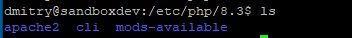
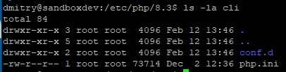
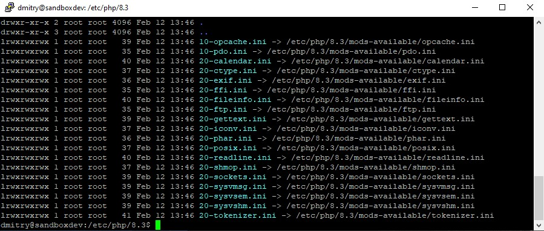
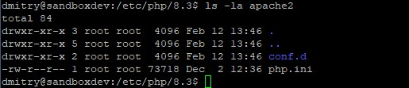
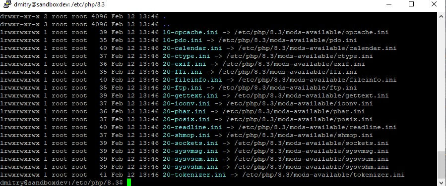
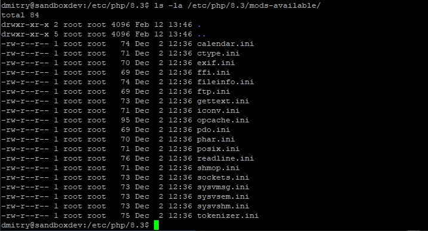
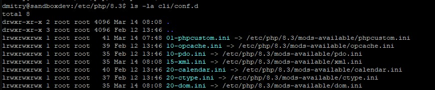

## 24. Upgrading and installing packages

Обновить список доступных пакетов  

    sudo apt-get update

Обновить установленное программное обеспечение  

    sudo apt-get upgrade

или с ответами по умолчанию "да" "yes" по всем вопросам

    sudo apt-get upgrade -y

Шаблон для установок:  

    apt-get install [PACKAGE] [PACKAGE]...  

Установка программ:  

    sudo apt-get install build-essential virtualbox-dkms nano zip unzip curl man-db acpid git module-assistant

, где:   

- build-essential - коллекция инструментов для компиляции програмного обеспечения.  
- virtualbox-dkms - модуль динамической поддержки ядра  
- module-assistant - управление пакетами ядра
- acpid - Advanced Configuration and Power Interface daemon

Перезагрузка сервера  

    sudo reboot

## 25. Installing VirtualBox Guest Additions

Первоначально нужно смонтировать диск с дополнениями в вирутальный cd-rom. Это делается из Виртуальной машины. Путь в Windows: 

C:\Program Files\Oracle\VirtualBox   

Далее работа в терминале.  

Поиск cd-rom'a

    ls -la /dev | grep cdrom

Просмотр каталога для файлов смонтированного диска из cd-rom'a. Он сейчас пуст.

    ls -la /media/cdrom

Создать папку при необходимости

    sudo mkdir /media/cdrom

Монтирование cd-roma в папку

    sudo mount /dev/cdrom  /media/cdrom

Предупреждение говорит о том, что диск смонтирован только для чтения.  

    mount: /media/cdrom: WARNING: source write-protected, mounted read-only.

Просмотр, какие файлы смонтировались. Файл установщика - VBoxLinuxAdditions.run  

    ls -la /media/cdrom

Запуск файла установщика из папки с указанием, что у нас нет графического интерфейса (--nox11)

    sudo sh /media/cdrom/VBoxLinuxAdditions.run --nox11

Перезагрузка

    sudo reboot

Проверка работы установленных дополнений  

    lsmod | grep vbox

> Надо найти запись vboxsf - модуль для share folders.  

> Также должна быть создана папка sf_sandbox для расшареных папок в /media. 

    ls -la /media

У меня создалась 

> sf_ubuntu_24.04_server   

согласно указанному имени в Общие папки.  

Эту папку можно поменять в настройках Общие папки, но, при замене папок, доступ к предыдущей расшаренной папке может пропасть из-за несоответствия группе - root vboxsf.  
Также, можно добавить несколько расшаренных папок.

 

Далее нужно будет предоставить права к расшареной папке.  

## 26. Configuring group permissions for access

Посмотреть права. В списке следуют сначала пользователь, потом - группа.

    ls -la /media
    ->
    total 16
    drwxr-xr-x  4 root root   4096 Sep  4 07:51 .
    drwxr-xr-x 23 root root   4096 Jul  5 08:38 ..
    drwxr-xr-x  2 root root   4096 Sep  4 07:35 cdrom
    drwxrwx---  1 root vboxsf 4096 Sep 11 07:58 sf_ubuntu_24.04_server

Попытка войти в папку будет отклонена по правам

    cd /media/sf_ubuntu_24.04_server/
    ->
    -bash: cd: /media/sf_ubuntu_24.04_server/: Permission denied

Показать мои группы

    id

Узнать, кто входит в группу vboxsf

    getent group vboxsf
    ->
    vboxsf:x:989:

> vboxsf:x:989:   
означает

    группа:пароль(x или пусто):идентификатор группы:список пользователей(сейчас пуст)

Добавить пользователя dmitry в группу vboxsf, где -a append (добавить), -G group (группа)

    sudo usermod -a -G vboxsf dmitry

Чтобы изменение вступило в силу, нужно выйти из системы и войти заново.  

    logout

Проверка после входа

    getent group vboxsf
    cd /media/sf_ubuntu_24.04_server/

> Доступ к папке для Apache

Проверка группы Apache

    id www-data
    ->
    uid=33(www-data) gid=33(www-data) groups=33(www-data)

На основе записи groups, группа - www-data.  

Предоставление к папке доступа для Apache, путём добавления пользователя Apache в группу vboxsf  

    sudo usermod -a -G vboxsf www-data

Проверка

    getent group vboxsf
    ->
    vboxsf:x:989:dmitry,www-data

Далее необходимо сконфигурировать Apache на работу с этой папкой.  

## 27. Configuring Apache HTTP Server

Конфигурация Linux хранится в /etc .  

    cd /etc

Показать список папок по одной в строке.

    ls -1

Показать список папок по фильтру Apache

    ls -1 | grep apache
    ->
    apache2

Возможно, что Apache не был установлен во время установки Ubuntu (глава 16). Тогда его нужно установить вручную.

https://ubuntu.com/server/docs/how-to-install-apache2

    sudo apt install apache2

Сайт Апаче по умолчанию должен открываться на машине хоста по адресу:  

    http://127.0.0.1:8080/

Приветственный файл Апачи расположен по адресу   
> /var/www/html/index.html

Однако он, вероятно, не будет работать после следующих перенастроек, т.к. в следующем параграфе в sites-enabled ссылка будет изменена с 000-deafault.conf на vboxsf.conf

Список папок в /apache/

    cd apache2
    ls -la

Основная конфигурация Apache хранится в файле apache2.conf. Распределённая конфигурация хранится в папках sites-available и sites-enabled .  

Просмотр

    ls -la sites-available
    ls -la sites-enabled

`sites-enabled` содержит ссылку на файл `000-default.conf` в папке `sites-available` .  

Файлы `.conf` - это настройки сайтов. Из папки `enabled` ссылки включают (запускают) сайты и ссылаются на настройки сайтов, расположенные в папке `available`. Т.е. в `sites-available` может быть расположено несколько файлов конфигурации, а в `sites-enabled` будут размещены именно те ссылки на конфигурационные файлы, которые делают сайты рабочими. 

Сами сайты расположены в папке 
> /var/www/html  

Создать файл конфигурации и вставить в него информацию из файла упражнений. Во время редактирования `sudoedit` создаёт временную копию файла до сохранения, чтобы не перезаписать оригинальный файл ещё до сохранения.   

    sudoedit sites-available/vboxsf.conf

    ctrl+X
    Y
    Enter

> Настроить порты Apache

    cd /etc/apache2
    sudoedit ports.conf

Дописать

    // было
    Listen 80    
    
    // стало
    Listen 80
    Listen 8080

    ctrl+X
    Y
    Enter

Далее нужно заставить Apache начать использовать эти новые конфигурации.  

## 28. Managing Apache sites and modules

Будут применены две команды. Они, по сути, создают символические ссылки для включения (отключения) сайтов в `enabled` папке, ссылающиеся на `available` папку.

> a2ensite  - Apache2 enables the site  
> a2dissite - Apache2 disables the site

Эти команды фактически создают и удаляют ссылки в директории `sites-enabled`, которые ссылаются на папку `sites-available`, таким образом включая и отключая сайты.

В папке `etc/apache2/sites-available` лежат файлы конфигураций под сайты: `000-default.conf`, `default-ssl.conf`, `vboxsf.conf`. В `sites-enabled` только предстоит создать ссылки, по умолчанию там одна ссылка `000-default.conf`.

**Создание ссылки на необходимый сайт**  

Делается из папки `etc/apache2`. Будет включена конфигурация сайта vboxsf, т.е. создана ссылка из `sites-enabled` на файл `../sites-available/vboxsf.conf`

    sudo a2ensite vboxsf 

**Отключение сайта (ссылки на сайт) по умолчанию**  

Будет отключена конфигурация сайта 000-default (удалена ссылка на `000-default.conf` из папки `sites-enabled`)  

    sudo a2dissite 000-default

Далее будут применены две команды, включающие и отключающие некоторые модули  

> a2enmode - Apache2 enables the module  
> a2dismode - Apache2 disables the module

**Включение некоторых модулей**

    sudo a2enmod rewrite vhost_alias

Требуется перезагрузка. Перезагрузка совершается командой service (службы), она имеет некоторые параметры (action)

- start
- stop
- restart
- reload - поддерживается не всеми службами

Также после `service` указывается имя службы. Таким образом, вид команды такой

> service [name][action]

**Перезагрузка Apache**

    sudo service apache2 restart

Терминал рекомендует другую команду:

>   systemctl reload apache2

В браузере можно проверить статус Апачи:

    127.0.0.1:8080/server-status

Далее нужно будет настроить PHP.

## 29. Configuring PHP for development

PHP установил вручную как самую последнюю версию. Через php/ondrej, как обычно, ничего не получилось.

В файл `/etc/apache2/sites-available/vboxsf.conf`, на который и только который идёт ссылка из `sites-enabled`, добавил наверх строку `DocumentRoot /media/sf_mysharefolder/`

    <VirtualHost *:80 *:8080>
    ServerName sandboxdev
    ServerAlias *.dev

    DocumentRoot /media/sf_mysharefolder/

Возможно, можно было внизу поменять следующую строку, указывая свою реальную папку, но я не менял и закомментировал:

    # VirtualDocumentRoot /media/sf_%1

После этого скопированные в общую папку файлы php заработали через браузер:

    http://127.0.0.1:8080/errors.php
    http://127.0.0.1:8080/phpinfo.php

Изменения файлов в php в общей папке в Windows сразу работают в браузере.  

---

Теперь нужно включить отображение ошибок, сейчас в настройках php display_errors: Off.  

    cd /etc/php/8.3

    ls
    -> apache2  cli  mods-available

  

Папки `apache2` и `cli` содержат аналогичную систему конфигурации соответсвенно одну для веб-запросов, другую - для запросов командной строки.  

    ls -la cli

Посмотреть файл конфигурации

    less cli/php.ini
    q

Посмотреть содержимое папок, сравнить их.  
Здесь будет похожий как у apaсhe аналог ссылок на папку `/etc/php/8.3/mods-available`

    ls -la cli/conf.d

    ls -la apache2

    la -la apache2/conf.d

**Оптимизация конфигурации**

Вместо двух конфигураций, создадим одну для apache2 и cli. 

Создать файл со следующим содержимым   

    sudoedit /etc/php/8.3/mods-available/phpcustom.ini  

    ; Custom shared config
    ; priority=01
    error_reporting=E_ALL
    display_errors=On
    display_startup_errors=On
    error_log=/var/log/php_errors.log
    log_errors_max_len=0
    memory_limit=256M
    post_max_size=100M
    upload_max_filesize=100M

    Ctrl+x
    Y
    Enter

**Включить эту конфигурацию**

Команды, которые включают и отключают мконфиги php:  

> phpenmod - enables mods/configs  
> phpdismod - disables mods/configs  

Список включенных модулей:  

> phpquery - lists enabled mods

Включение phpcustom. Это приведёт к тому, что конфигурации из папок `apache2` и `cli` будут ссылаться, помимо прочего, на 
phpcustom.ini. И, следовательно, будут подхватываться и работать указанные там настройки php.

    sudo phpenmod phpcustom

Что в списке модулей:

    phpquery -v 8.3 -s apache2 -M

phpcustom отсутствует в списке, потому что это не модуль  

**Создать файл error-log**

Несмотря на настройки с логами в файле .ini, самого файла логов ещё пока нет. Поэтому:  

    sudo touch /var/log/php_errors.log  

Дать разрешения на файл. Сейчас права у него - root root. В команде указывается `пользователь:группа`, группу можно оставить пустой.     

    sudo chown www-data: /var/log/php_errors.log

**Установка зависимостей для PHP**

- mcrypt - encryption library
- intl - internationalization
- sqlite3 - SQLite version 3 database
- mbstring - multibyte string
- simplexml - XML toolset
- gd – image processing   

    sudo apt-get install php-mcrypt php-intl php-sqlite3 php-mbstring php-xml php-gd -y

 Два из них надо включить явно:

    sudo phpenmod mbstring simplexml   

Рестарт веб-сервера  

    sudo service apache2 restart

Обновить errors.php в браузере и посмотреть на файл логов  

    tail /var/log/php_errors.log

## 30. Installing MailCatcher for dev email

Установка включает следующее

- Зависимости  
    - ruby
    - libqlite3
- Создать службу почты
- Сконфигурировать PHP под email

> Зависимости

    sudo apt-get install libsqlite3-dev ruby-dev -y

> Установить MailCatcher

    sudo gem install mailcatcher

Справка

    mailcathcer --help

Почту как автоматически заупскаемую службу только предстоит создать

    sudoedit /lib/systemd/system/mailcatcher.service

Скопировать данные из упражнений

    [Unit]
    Description=MailCatcher Service

    [Service]
    Type=simple
    ExecStart=/usr/local/bin/mailcatcher --foreground --ip 0.0.0.0

    [Install]
    WantedBy=multi-user.target

Вставить, сохранить и выйти

    Ctrl+x
    Y
    Enter

> Запуск службы

    sudo service mailcatcher start

Настройка службы на автоматический запуск

    sudo systemctl enable mailcatcher.service

Проверить статус запуска службы

    sudo service mailcatcher status
    # выход
    q

> Настроить PHP

Создать конфигурацию для PHP

    sudoedit /etc/php/8.3/mods-available/mailcatcher.ini
    
Вставить.  
Строчка `sendmail_from = mailcatcher@sandbox.dev` опциональна, но полезна.  

    sendmail_path = /usr/local/bin/catchmail
    sendmail_from = mailcatcher@sandbox.dev
    
Сохранить

    Ctrl+x
    Y
    Enter   

> Запустить новую конфигурацию 

    sudo phpenmod mailcatсher

>> Эта команда не работала, пока 

~~не заиграл Tupac-Changes~~ не залез в кастомную phpcustom.ini (о, зачем мы её создавали!) и не поставил там строчку

    extension=mailcatcher

>> Не помогло следующее

- эта же строчка в php.ini

- символические ссылки, созданные в обоих conf.d по имеющемуся подобию так на файл `/etc/php/8.3/mods-available/mailcatcher.ini`

      ln -s source_file symbolic_link

Перезапуск апачи
 
    sudo service apache2 restart

Проверка подхвата mailcatcher'a от PHP

    php -i | grep sendmail

Но остаётся ошибка, описанная тут 

https://askubuntu.com/questions/998199/warning-module-mcrypt-ini-file-doesnt-exist-under-etc-php-7-2-mods-available

Ещё немного об этом

https://qna.habr.com/q/175667

MailCatcher запускается из браузера локальной машины по порту 1080:  

    http://127.0.0.1:1080/

Тестовый запуск письма из терминала SSH

    php -a

    mail('target@example.com', 'First Test Email', 'Yes, this is a dog', 'From: source@example.com');
    exit

В Firefox письма приходят даже без обновления страницы браузера.

---
