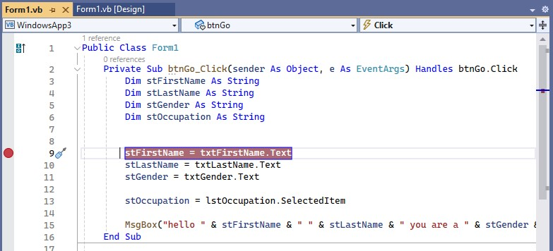

Неофициальный код:  
https://github.com/Kris-fynn/VB.NET/blob/main/OutputAndVariables/Form1.vb

Плэйлист:  
https://www.youtube.com/watch?v=XM3mXeTrSeE&list=PLTd6ceoshpremSFQxYM4L0p4Q6hR-4e4J&index=3

## 1. Hello VS

Код для кнопки

```vb
Public Class Form1

    Private Sub btnStart_Click(sender As Object, e As EventArgs) Handles btnStart.Click

        MsgBox("hello world")
        MsgBox("how are you")
        MsgBox("i hope you are well")

    End Sub

End Class
```

## 2. Customise VS

    WindowsApp1.sln

Это файл Решений (Solution) проекта в папке проекта. По нему можно запустить проект.

Некоторые настройки VS:

Место проектов меняется в

> Tools - Options - Projects and Solutions - Locations

## 3. Output and Variables

3 фундаментальные конструкции существуют в процедурных языках:  
- последовательность
- выбор
- итерация

Конкатенация:

    &

Варианты написания msgBox:
```vb
    MsgBox("welcome to the course")

    MessageBox.Show("this is another message")
```

Пример объявления и использования переменных:
```vb
Dim stFirstName As String
Dim stLastName As String

stFirstName = "Kevin"
stLastName = "Drumm"

MsgBox("hello and welcome " & stFirstName & " " & stLastName & " I hope you are well")

stFirstName = "Murvin"
stLastName = "Drake"

MsgBox("hello and welcome " & stFirstName & " " & stLastName & " I hope you are well")
```

Dim - образовано от dimension (выделение памяти).

## 4. Variable Data Types

```vb
 Private Sub btnDataTypes_Click(sender As Object, e As EventArgs) Handles btnDataTypes.Click

     Dim stMake As String
     Dim stModel As String
     Dim iDoors As Integer
     Dim stColour As String
     Dim bTaxed As Boolean
     Dim iEngineSize As Integer
     Dim decPrice As Decimal
     Dim dtDateRegistered As Date

     stMake = "Ford"
     stModel = "Escort"
     iDoors = 5
     stColour = "red"
     bTaxed = True
     iEngineSize = 1200
     decPrice = 999.99
     dtDateRegistered = #11/2/2020#  ' Это 2 ноября, американский формат

     MsgBox("the car is " & stMake & " " & stModel & " " &
            iDoors & " " & stColour & " " & bTaxed & " " &
            iEngineSize & " " & decPrice & " " & dtDateRegistered)

 End Sub
```

Пробелы " " можно заменить константой vbNewLine, которая переносит строки. 

```c#
    # вместо
    & " " &
    # это
    & vbNewLine &
```

## 5. Input with Windows Forms

Простая процедура для формы с одним полем ввода:

```vb
    Private Sub btnGo_Click(sender As Object, e As EventArgs) Handles btnGo.Click

        Dim stFirstName As String

        stFirstName = InputBox("please enter your first name")

        MsgBox("hello " & stFirstName)

    End Sub
```

Процедура для формы с тремя полями ввода и кнопкой:

```vb
Private Sub btnGo_Click(sender As Object, e As EventArgs) Handles btnGo.Click

    Dim stFirstName As String
    Dim stLastName As String
    Dim stGender As String

    stFirstName = txtFirstName.Text
    stLastName = txtLastName.Text
    stGender = txtGender.Text

    MsgBox("hello " & stFirstName & " " & stLastName & " you are a " & stGender)

End Sub
```

То же самое, но со списком выбора, List Box

```vb
Private Sub btnGo_Click(sender As Object, e As EventArgs) Handles btnGo.Click
    Dim stFirstName As String
    Dim stLastName As String
    Dim stGender As String
    Dim stOccupation As String

    stFirstName = txtFirstName.Text
    stLastName = txtLastName.Text
    stGender = txtGender.Text

    stOccupation = lstOccupation.SelectedItem

    MsgBox("hello " & stFirstName & " " & stLastName & " you are a " & stGender & " " & stOccupation)
End Sub
```

То же самое, но с добавлением в список выбора еще трех элементов через загрузку формы (своего рода конструктор при инициализации формы). Список будет добавлен в выбор опций, когда форма загрузится.  

```vb
Private Sub Form1_Load(sender As Object, e As EventArgs) Handles MyBase.Load

    lstOccupation.Items.Add("Writer")
    lstOccupation.Items.Add("Actor")
    lstOccupation.Items.Add("Painter")

End Sub
```

## 6. Debugging Code

### Breakpoints

Установка точки останова  



Кнопки управления:  


### Syntax Error  

Выявление ошибок после запуска  


## 7. Arithmetic Operators

```vb
Private Sub btnCalculate_Click(...)...

    Dim iNumber1 As Integer
    Dim iNumber2 As Integer

    Dim iResult As Integer

    iNumber1 = txtNumber1.Text
    iNumber2 = txtNumber2.Text

    iResult = iNumber1 / iNumber2 'при Integer выдаст целое число 
    MsgBox(iResult)

End Sub
```

```vb
Private Sub btnCalculate_Click(...)...

    Dim dblNumber1 As Double
    Dim dblNumber2 As Double

    Dim dblResult As Double

    dblNumber1 = txtNumber1.Text
    dblNumber2 = txtNumber2.Text

    dblResult = dblNumber1 + dblNumber2
    MsgBox(dblResult)

    dblResult = dblNumber1 - dblNumber2
    MsgBox(dblResult)

    dblResult = dblNumber1 * dblNumber2
    MsgBox(dblResult)

    dblResult = dblNumber1 / dblNumber2
    MsgBox(dblResult)

    dblResult = dblNumber1 ^ dblNumber2  'возведение в степень
    MsgBox(dblResult)

    dblResult = dblNumber1 \ dblNumber2  'целочисленное деление
    MsgBox(dblResult)

    dblResult = dblNumber1 Mod dblNumber2  'остаток от деления
    MsgBox(dblResult)
End Sub
```

При арифметическимх операциях из текстовых полей VB преобразует вводимые числа из строкового типа в числовой.  

## 8. Complex Arithmetic Expressions

```vb
 Private Sub btnCalculate_Click(sender As Object, e As EventArgs) Handles btnCalculate.Click
     Dim decPrice As Decimal
     Dim iQuantity As Integer
     Dim decDiscount As Decimal
     Dim decTotalCost As Decimal
     Dim decPostage As Decimal

     decPrice = 5
     iQuantity = 10
     decDiscount = 2
     decPostage = 3

     decTotalCost = ((decPrice - decDiscount) * iQuantity) + decPostage

     MsgBox(decTotalCost)

     Dim iResult As Integer
     iResult = 10 - 5 + 2
     MsgBox(iResult)

     iResult = 10 + 2 - 5
     MsgBox(iResult)

     iResult = 10 - 2 + 5
     MsgBox(iResult)


     iResult = 10 / 5 * 2
     MsgBox(iResult)

     iResult = 2 * 10 / 5
     MsgBox(iResult)

     iResult = 10 * 5 / 2
     MsgBox(iResult)

 End Sub
```

## 9. Selection with If Statements

3 фундаментальные конструкции существуют в процедурных языках:  
- последовательность
- выбор
- итерация

Здесь рассказывается о Выборе.

В VB одиночное равно (=) используется и для присваивания, и для проверки на равенство.

Однострочный if

```vb
 Dim stCountry As String
 stCountry = txtCountry.Text

 If stCountry = "Australia" Then MsgBox("G'day mate")
```

Многострочный if

```vb
 Private Sub btnGreet_Click(sender As Object, e As EventArgs) Handles btnGreet.Click
     Dim stCountry As String
     stCountry = txtCountry.Text

     If stCountry = "Australia" Then
         MsgBox("G'day mate")
         MsgBox("Good on ya")
         MsgBox("No worries")
     End If
 End Sub
```

ElseIf

```vb
Private Sub btnGreet_Click(sender As Object, e As EventArgs) Handles btnGreet.Click
    Dim stCountry As String
    stCountry = txtCountry.Text

    If stCountry = "Australia" Then
        MsgBox("G'day mate")
        MsgBox("Good on ya")
        MsgBox("No worries")
    ElseIf stCountry = "France" Then
        MsgBox("Bonjour")
        MsgBox("Comment allez-vous?")
    End If
End Sub
```

Несколько ElseIf и один Else

```vb
Private Sub btnGreet_Click(sender As Object, e As EventArgs) Handles btnGreet.Click
    Dim stCountry As String
    stCountry = txtCountry.Text

    If stCountry = "Australia" Then
        MsgBox("G'day mate")
        MsgBox("Good on ya")
        MsgBox("No worries")
    ElseIf stCountry = "France" Then
        MsgBox("Bonjour")
        MsgBox("Comment allez-vous?")
    ElseIf stCountry = "Japan" Then
        MsgBox("Konnichiwa")
        MsgBox("Choushi wa dou desu ka")
    Else
        MsgBox("Hello there")
        MsgBox("I hope, you are well")
    End If
End Sub
```

Все эти if чувствительны к регистру.  
Убрать чувствительность к регистру тем, что в переменную всегда будут попадать преобразованные буквы в верхнем регистре.  

```vb
 Dim stCountry As String
 stCountry = txtCountry.Text
 stCountry = stCountry.ToUpper
 'введённые буквы будут преобразованы в верхний регистр

 If stCountry = "AUSTRALIA" Then
     MsgBox("G'day mate")
     MsgBox("Good on ya")
     MsgBox("No worries")
 ElseIf stCountry = "FRANCE" Then
     MsgBox("Bonjour")
     MsgBox("Comment allez-vous?")
 ElseIf stCountry = "JAPAN" Then
     MsgBox("Konnichiwa")
     MsgBox("Choushi wa dou desu ka")
 Else
     MsgBox("Hello there")
     MsgBox("I hope, you are well")
 End If
```

Вариант - не перезаписывать введённую пользователем переменную, т.к. она может понадобиться далее в коде, а преобразовывать её только для тестов.  

```vb
 Dim stCountry As String
 stCountry = txtCountry.Text

 If stCountry.ToUpper = "AUSTRALIA" Then
 ' частное преобразование
     MsgBox("G'day mate")
     MsgBox("Good on ya")
     MsgBox("No worries")
 ElseIf stCountry.ToUpper = "FRANCE" Then
 ' частное преобразование
     MsgBox("Bonjour")
     MsgBox("Comment allez-vous?")
 ElseIf stCountry.ToUpper = "JAPAN" Then
 ' частное преобразование
     MsgBox("Konnichiwa")
     MsgBox("Choushi wa dou desu ka")
 Else
     MsgBox("Hello there")
     MsgBox("I hope, you are well")
 End If

 MsgBox("You entered " & stCountry)
 ' изначально введённая пользователем переменная
```

## 10. Logical and Relational Operators 1

