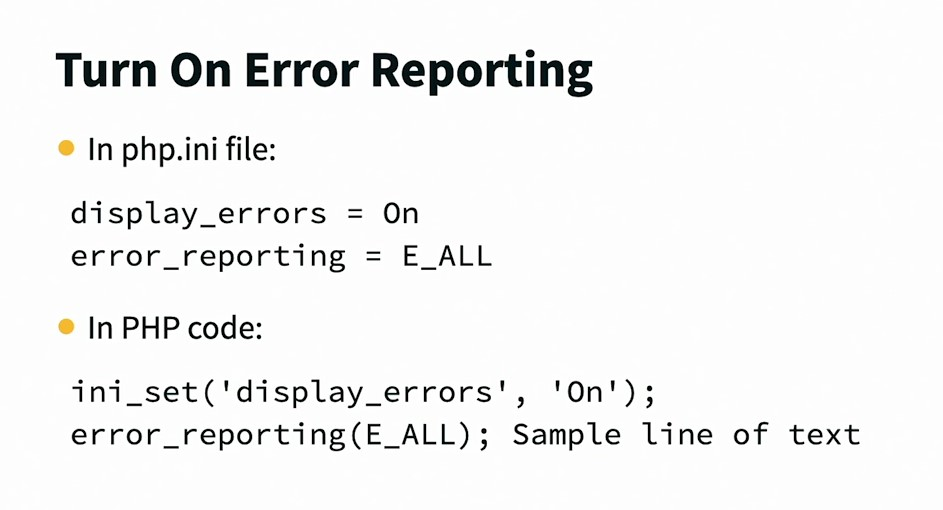
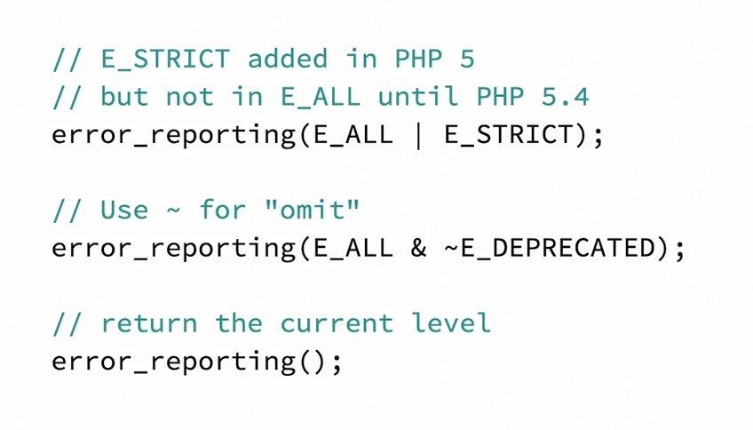
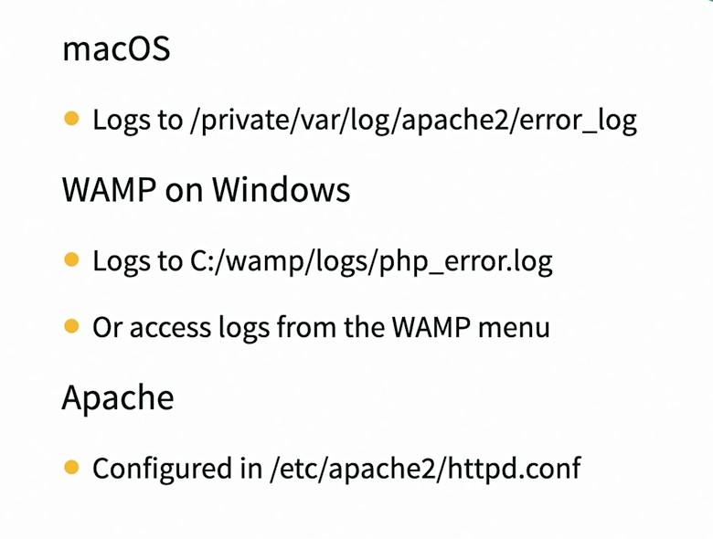
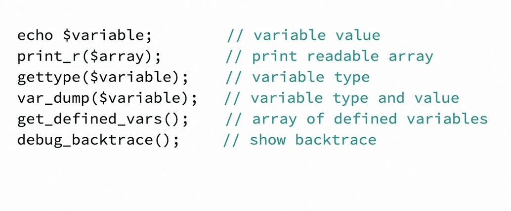

## 040-Common problems

Когда-то E_ALL не включал в себя строгие ошибки E_STRICT и последний нужно было указывать дополнительно.  
Исключение типов ошибок из отчётов достигается с помощью тильда ~ .  
Отобразить число, отвечающее за текущий образ отображений ошибок, достигается вызовом функции без аргументов. Полный список можно посмотреть здесь:  
https://www.php.net/manual/en/errorfunc.constants.php  

  

Логи и место хранения кофигурации логов:  

  

## 041-Debug and troubleshoot

  
  

---

