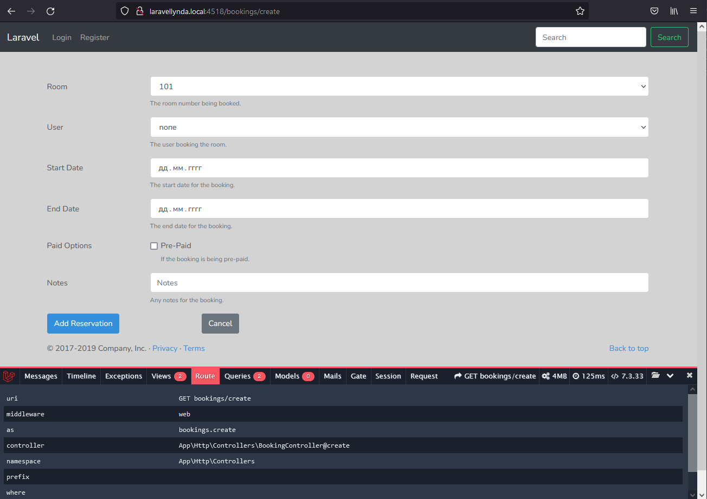

19

http://laravellynda.local:4518/bookings/create

1. Работает Get-запрос в адресной строке. Он же работает по кнопке "Add New Booking".
2. Маршрут web.php направляет на ресурсный BookingController, означающий множество зарегистрированных маршрутов. В данном случае этот url направляет на BookingController@create .
3. Метод @create создаёт переменные $users, $rooms (с двумя запросами к базе данных) и направляет их в вызываемую вью resources\views\bookings\create.blade.php .
4. create.blade.php состоит из общего шаблона resources\views\layouts\app.blade.php и секции @content, подставляемую в этот шаблон.
