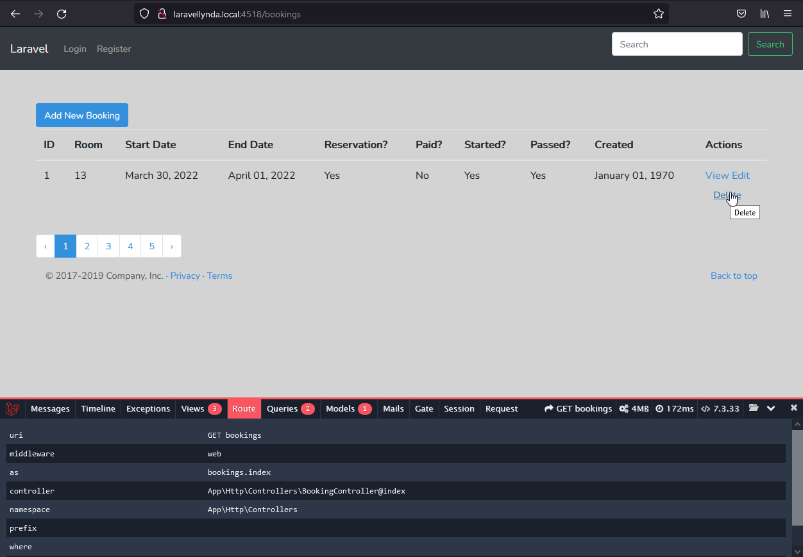

## 30. Editing

### BookingController@update

http://laravellynda.local:4518/bookings/1/edit

Теперь, при редактировании записи по кнопке "Add Reservation", в работу вступают две строчки модели Booking вместо DB

    $booking->fill($request->input());
    $booking->save();

### BookingController@destroy

http://laravellynda.local:4518/bookings

Удаление записи тоже происходит при помощи Booking вместо DB, работает одна строка:

    $booking->delete();

