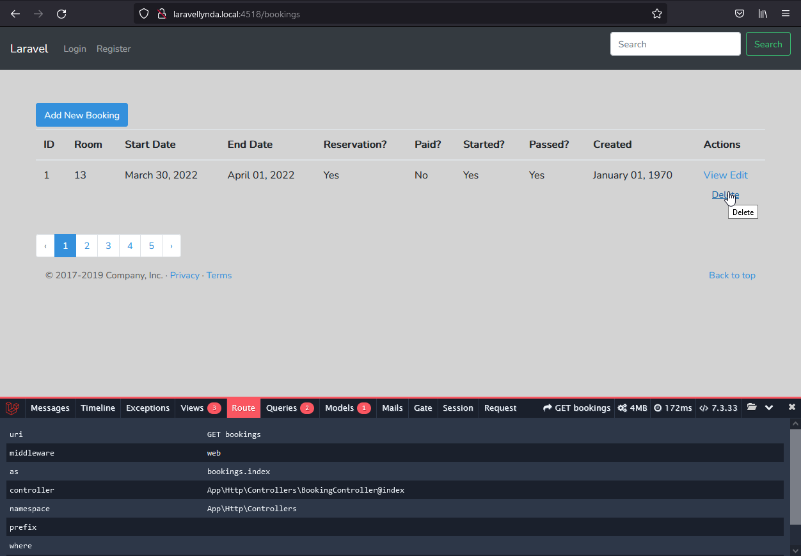

## 31. Soft-deleting

Soft deleting (мягкое удаление) используется для удаления записи из приложения, но не удаления его из базы данных. Для этого рабтают две строчки use в модели Booking. Больше ничего менять не нужно.

    use Illuminate\Database\Eloquent\SoftDeletes;

    class Booking extends Model {
        use SoftDeletes;

http://laravellynda.local:4518/bookings