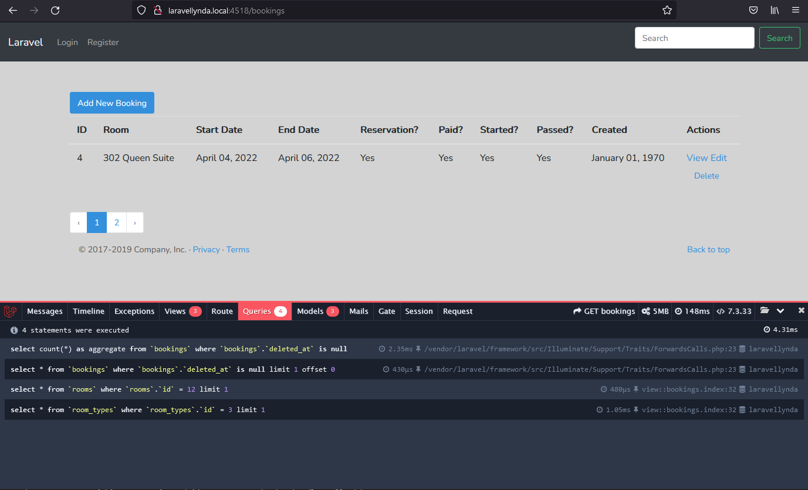
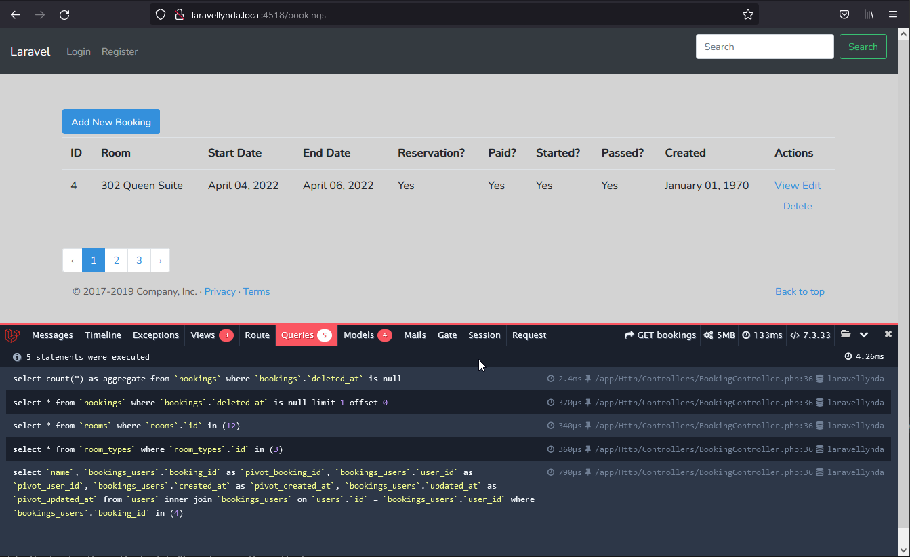

## 37. Eager_loading_relationships

http://www.itmathrepetitor.ru/laravel-5-otnosheniya-i-zhadnaya-zagruzka-v-eloquent/

https://laravel.ru/forum/viewtopic.php?id=2359

Жадная загрузка (eager loading) - загружаем все, что может понадобиться, ленивая загрузка (lazy loading) - загружаем только то, что требуется.

Жадная загрузка может быть добавлена в модель (Booking) методом with().

Пример работы без жадной загрузки:

http://laravellynda.local:4518/bookings

Пример работы с жадной загрузкой:

http://laravellynda.local:4518/bookings