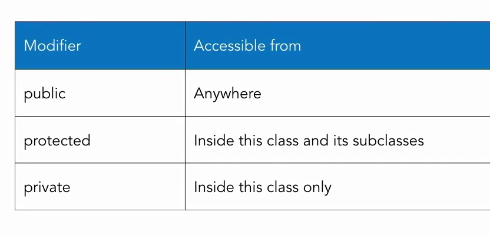

## 01 - Visibility modifiers



```php
class Student {

  public $first_name;
  public $last_name;
  public $country = 'None';

  protected $registration_id;
  private $tuition = 0.00;

  public function full_name() {
    return $this->first_name . " " . $this->last_name;
  }

  public function hello_world() {
    return 'Hello world!';
  }

  protected function hello_family() {
    return 'Hello family!';
  }

  private function hello_me() {
    return 'Hello me!';
  }

}

class PartTimeStudent extends Student {
  public function hello_parent() {
    return $this->hello_family();
  }
}

//$student1 = new Student;
$student1 = new PartTimeStudent;
$student1->first_name = 'Lucy';
$student1->last_name = 'Ricardo';

//echo $student1->registration_id;      // вызов запрещен
//echo $student1->tuition;              // вызов запрещен

echo $student1->full_name() . "<br />";

echo $student1->hello_world() . "<br />";
//echo $student1->hello_family() . "<br />";  // вызов запрещен
//echo $student1->hello_me() . "<br />";      // вызов запрещен
echo $student1->hello_parent() . "<br />";    // работает из подкласса

```

## 02 - Beware of overloading. Остерегайтесь перегрузки

Перегрузка атрибутов означает, что приватные переменные класса могут быть переопределены и заданы заново в подклассе и к ним может быть получен доступ, несмотря на приватность (будет создана новая переменная с тем же названием для подкласса), но сами по себе в классе переменные останутся неизменными и недоступными для других классов (старая переменная и ее значение остаются неизменными).

Общий пример оверлодинга. Простой класс без свойств.

```php
class Product {
}

$p = new Product;
echo $p->name;  // Notice: Undefined property: Product::$name

// Но при новом объявлении такой переменной, к-рая не задана в классе, она начинает работать без ошибок
$p->name = 'Guitar';
echo $p->name;  // Guitar
```

Пример оверлодинга

```php
<?php

class Student {

  public $first_name;
  public $last_name;
  public $country = 'None';

  protected $registration_id;
  private $tuition = 500.00;

    public function tuition_fmt() {
    return '$' . $this->tuition;
  }

}

class PartTimeStudent extends Student {
  
}

$student1 = new PartTimeStudent;

//echo $student1->tuition;                 // вызов запрещен

// однако при задании этой переменной, она будет создана как новая динамическая переменная, и к ней будет доступ без ошибок
$student1->tuition = 1000;
echo $student1->tuition . '<br />';        // 1000

// тем не менее, сама переменная из класса осталась неизменной и по-прежнему равна старому значению
echo $student1->tuition_fmt() . '<br />';  // 500

?>
```

## 
